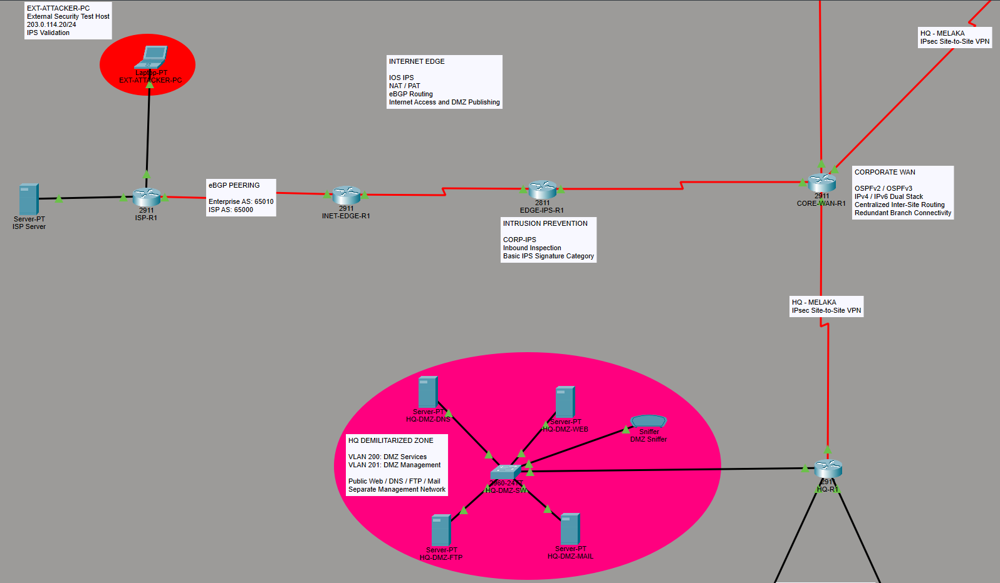

# Enterprise Multi-Site Network

A multi-site enterprise network designed and implemented in **Cisco Packet Tracer**, connecting a Headquarters environment with two branch offices in **Melaka** and **Kuching**.

The project brings together enterprise switching, routing, redundancy, centralized services, wireless networking, VoIP, IoT, Internet connectivity, a DMZ, and multiple security controls within one integrated topology.

---

## Network Overview


The environment is divided into three corporate locations:

| Site | IPv4 Address Space | IPv6 Address Space | Main Design |
|---|---|---|---|
| Headquarters | `10.10.0.0/22` | `2001:DB8:10::/48` | Redundant multilayer switching |
| Melaka | `172.20.0.0/23` | `2001:DB8:20::/48` | Redundant Router-on-a-Stick with HSRP |
| Kuching | `192.168.50.0/23` | `2001:DB8:30::/48` | Router-on-a-Stick with VoIP/CME |

The three sites are interconnected through a corporate WAN using **OSPFv2 for IPv4** and **OSPFv3 for IPv6**.

A separate Internet edge provides simulated ISP connectivity, public service publishing, NAT/PAT, eBGP, and IPS inspection.

---

## Project Goals

The project was built to practice the design and integration of multiple enterprise networking technologies rather than configuring each feature as an isolated lab.

The main objectives were to:

- Build a routed multi-site enterprise environment
- Segment departments and services using VLANs
- Introduce Layer 2 and Layer 3 redundancy
- Deploy IPv4 and IPv6 in dual-stack mode
- Centralize common network services
- Integrate enterprise wireless networking
- Add IoT and VoIP services
- Build a dedicated DMZ for public-facing services
- Simulate Internet connectivity and public service publishing
- Apply layered network security controls
- Validate the design through functional and security testing

---

## Key Technologies

### Switching and Layer 2

- VLAN segmentation
- IEEE 802.1Q trunking
- LACP EtherChannel
- Rapid-PVST
- Native VLAN
- Blackhole VLAN
- Port Security

### Routing and Redundancy

- Inter-VLAN routing
- Router-on-a-Stick
- HSRP
- OSPFv2
- OSPFv3
- Backup WAN path using OSPF cost
- IPv4 / IPv6 dual stack

### Network Services

- Centralized DHCP
- DHCP relay
- Internal DNS
- Split DNS
- NTP
- Syslog
- Corporate intranet

### Wireless, IoT and Voice

- Wireless LAN Controller
- Lightweight Access Points
- Staff, Guest and IoT WLANs
- Centralized IoT registration
- IoT automation
- Cisco CallManager Express
- Voice VLAN
- DHCP Option 150

### Internet and DMZ

- Dedicated DMZ
- Public Web, DNS, FTP and Mail services
- NAT
- PAT
- Static NAT
- eBGP
- Public DNS
- SPAN traffic monitoring

### Security

- Guest network ACLs
- IoT network ACLs
- DMZ management restrictions
- DMZ-to-internal isolation
- Internet edge filtering
- Site-to-site IPsec VPN
- IOS IPS
- AAA / RADIUS
- SSHv2

---

## Architecture Highlights

The project intentionally uses different network designs at each site rather than duplicating the same architecture everywhere.

### Headquarters

HQ uses two multilayer distribution switches with:

- HSRP gateway redundancy
- LACP EtherChannels
- Rapid-PVST
- Centralized enterprise services
- Wireless infrastructure
- Internal server networks
- Dedicated DMZ connectivity

### Melaka

Melaka demonstrates a redundant branch architecture using:

- Two Router-on-a-Stick gateways
- HSRP
- OSPFv2 / OSPFv3
- Wireless Staff, Guest and IoT networks
- Site-to-site IPsec VPN with HQ
- Backup WAN connectivity toward Kuching

### Kuching

Kuching uses a simpler branch design with:

- Single Router-on-a-Stick gateway
- OSPFv2 / OSPFv3
- Wireless connectivity
- IoT
- Voice VLAN
- Cisco CME
- Local DHCP Option 150 for IP phones

---

## Internet Edge and DMZ



The Internet perimeter includes:

- Enterprise Internet edge router
- IOS IPS router
- Simulated ISP
- Simulated Internet server
- External security test host
- Public-facing DMZ

The enterprise public block is advertised to the ISP using **eBGP**, while internal users share a public IPv4 address through PAT.

Dedicated static NAT mappings publish the DMZ Web, DNS, FTP and Mail services.

DMZ servers are also restricted from initiating arbitrary connections toward internal enterprise networks.

---

## Security Approach

Security controls are distributed throughout the topology rather than relying on a single device.

Examples include:

- VLAN-based separation
- Guest and IoT ACL policies
- Port Security
- Disabled unused switch ports
- DMZ service and management separation
- DMZ-to-internal isolation
- Internet edge ACL filtering
- IPsec encryption
- IOS IPS inspection
- Centralized AAA / RADIUS authentication
- SSHv2 remote administration

The IOS IPS was also validated with a dedicated external test host.

A controlled ICMP flow was temporarily allowed through the perimeter ACL so that the traffic could reach the IPS. The IPS then blocked the test traffic while legitimate HTTP access to the same public Web server remained available.

---

## Validation

The topology was tested progressively during implementation.

Validation included:

- VLAN and trunk verification
- EtherChannel status
- Spanning Tree operation
- HSRP state verification
- OSPFv2 and OSPFv3 neighbor formation
- IPv4 and IPv6 inter-site communication
- Remote DHCP allocation
- DNS resolution
- NTP synchronization
- Centralized Syslog
- Wireless client connectivity
- IoT registration and automation
- VoIP calls
- NAT and PAT translations
- eBGP route advertisement
- Public Web and FTP access
- IPsec encrypted traffic
- ACL enforcement
- IPS blocking
- AAA authentication
- SSHv2 remote login

Screenshots and detailed explanations are available throughout the documentation.

---

## Documentation

Detailed documentation is separated by topic:

1. [Network Architecture](docs/01-architecture.md)
2. [IP Addressing and VLAN Design](docs/02-ip-addressing-vlans.md)
3. [Layer 2 Design](docs/03-layer2-design.md)
4. [Routing and Redundancy](docs/04-routing-redundancy.md)
5. [IPv6 Design](docs/05-ipv6.md)
6. [Network Services](docs/06-network-services.md)
7. [Wireless, IoT and VoIP](docs/07-wireless-iot-voip.md)
8. [DMZ and Internet Edge](docs/08-dmz-internet-edge.md)
9. [Security](docs/09-security.md)
10. [Testing and Packet Tracer Limitations](docs/10-testing-limitations.md)

---

## Packet Tracer Project

The complete Cisco Packet Tracer topology is included in the repository:

[Open the Packet Tracer project](packet-tracer/enterprise-multisite-network.pkt)

The `.pkt` file can be used to inspect the topology, device configurations, addressing, services, and validation environment directly.

---

## Repository Structure

```text
enterprise-multisite-network/
│
├── README.md
│
├── packet-tracer/
│   └── enterprise-multisite-network.pkt
│
├── docs/
│   ├── 01-architecture.md
│   ├── 02-ip-addressing-vlans.md
│   ├── 03-layer2-design.md
│   ├── 04-routing-redundancy.md
│   ├── 05-ipv6.md
│   ├── 06-network-services.md
│   ├── 07-wireless-iot-voip.md
│   ├── 08-dmz-internet-edge.md
│   ├── 09-security.md
│   └── 10-testing-limitations.md
│
└── screenshots/
    ├── architecture/
    ├── layer2-design/
    ├── Routing/
    ├── ipv6/
    ├── Services/
    ├── Wireless-IoT-VoIP/
    ├── DMZ-Internet-Edge/
    └── Security/
```

---

## Packet Tracer Limitations

Several simulator-specific limitations were encountered during implementation, including:

- WLC behavior
- CME platform support
- IPv6 multilayer-switch requirements
- HSRPv6 failover behavior
- ACL binding persistence
- Passive FTP through static NAT
- AAA fallback behavior
- Simplified IOS IPS implementation

These limitations and the design decisions made around them are documented in:

[Testing and Packet Tracer Limitations](docs/10-testing-limitations.md)

---

## Notes

This project is a simulated enterprise networking lab created for learning and portfolio purposes.

Credentials visible in the Packet Tracer topology or screenshots are lab-only credentials and are not used outside this environment.
