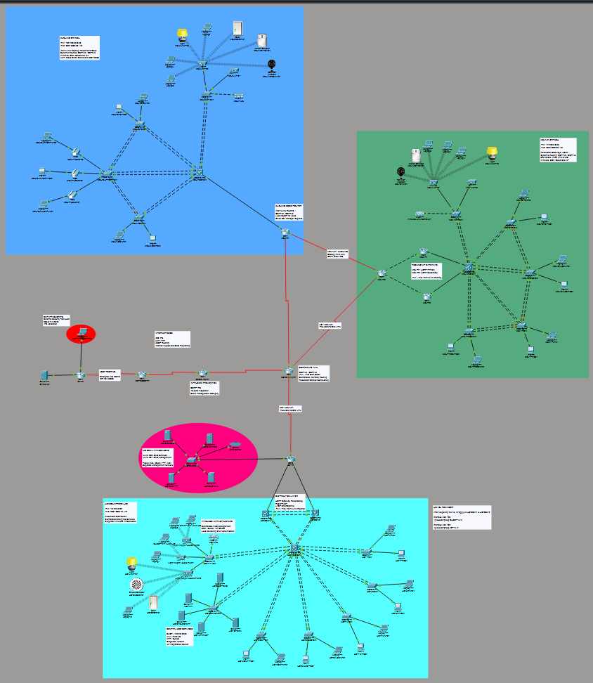
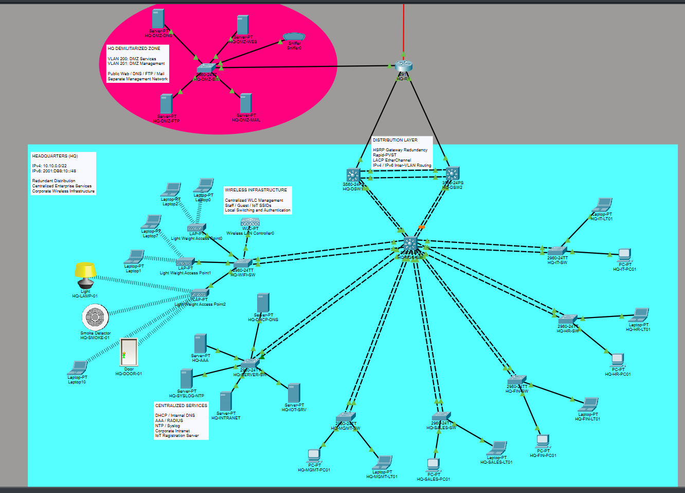
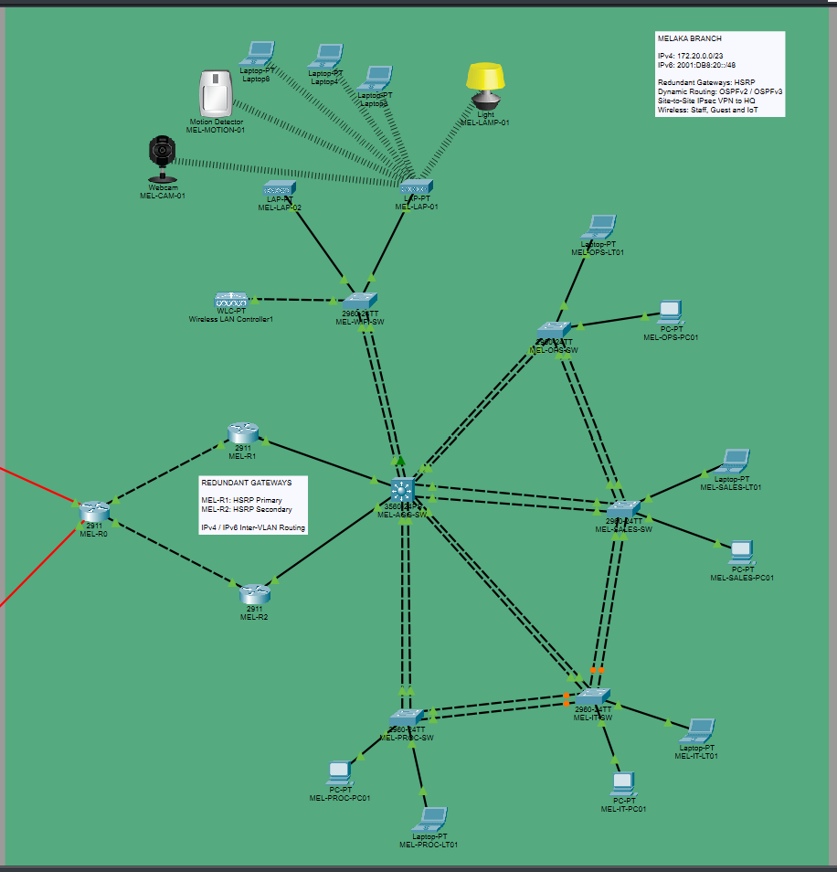
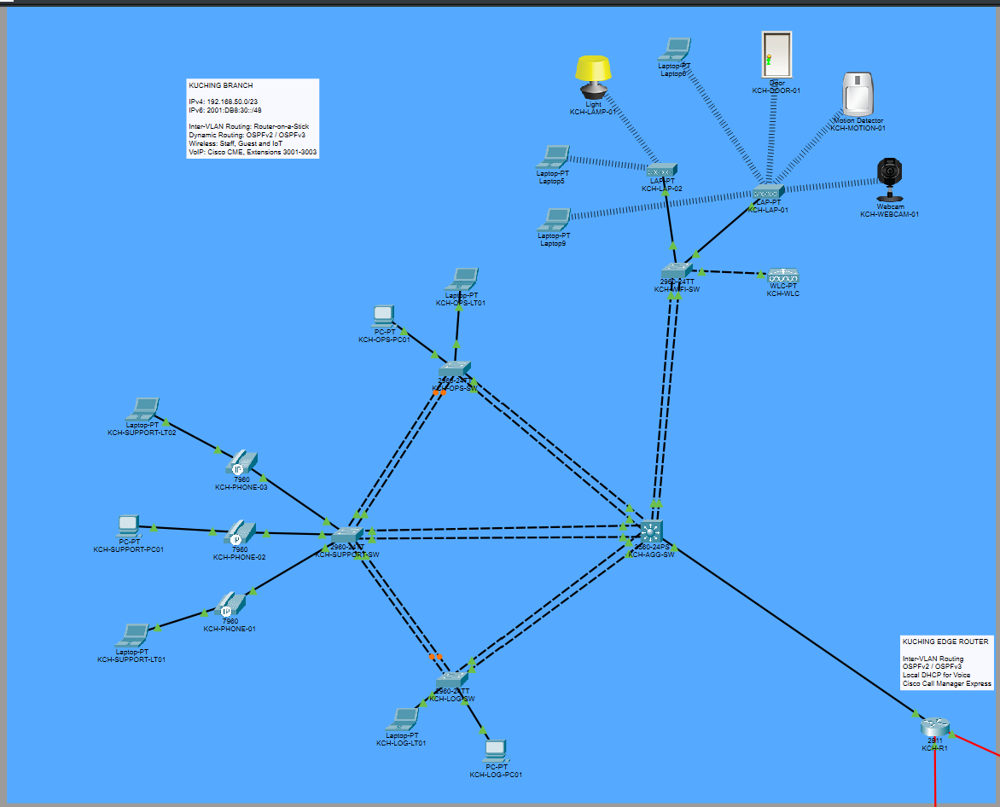

# Network Architecture

## Overview

This project simulates a multi-site enterprise network designed in Cisco Packet Tracer.

The environment is composed of three corporate locations:

- **Headquarters (HQ)**
- **Melaka Branch**
- **Kuching Branch**

The sites are interconnected through a centralized corporate WAN and use a combination of Layer 2 redundancy, dynamic routing, IPv4/IPv6 dual-stack connectivity, centralized services, wireless networking, VoIP, IoT, and multiple security controls.

The design also includes a simulated Internet edge with an ISP, eBGP routing, NAT/PAT, public service publishing, a demilitarized zone (DMZ), an IOS IPS router, and an external security test host.

---

## Enterprise Topology

The topology is divided into several functional areas:

- Headquarters campus
- Melaka branch
- Kuching branch
- Corporate WAN
- Internet edge
- DMZ
- External Internet simulation

Each area was designed independently and then integrated through dynamic routing and centralized services.

---

## Design Goals

The network was designed around the following objectives:

- Provide connectivity between three geographically separated sites.
- Separate users and services using VLAN-based segmentation.
- Introduce redundancy at both Layer 2 and Layer 3.
- Support both IPv4 and IPv6.
- Centralize common enterprise services.
- Provide separate Staff, Guest, and IoT wireless networks.
- Support branch VoIP through Cisco CME.
- Isolate public-facing services inside a DMZ.
- Simulate enterprise Internet connectivity using NAT/PAT and eBGP.
- Protect internal resources through ACLs, port security, IPS, VPN, AAA, and SSH.
- Validate the design through functional and security testing.

---

# Headquarters

Headquarters contains the largest portion of the infrastructure and acts as the main enterprise site.

Its architecture includes:

- Two multilayer distribution switches
- A central aggregation layer
- Departmental access switches
- Redundant Layer 2 links using EtherChannel
- HSRP gateway redundancy
- Centralized internal services
- Wireless infrastructure using a WLC and lightweight access points
- A dedicated DMZ
- Connectivity toward the corporate WAN

HQ hosts the majority of shared enterprise services, including DHCP, internal DNS, AAA/RADIUS, NTP, Syslog, intranet services, and the IoT registration server.

The distribution layer also provides inter-VLAN routing for most HQ networks.

---

# Melaka Branch

The Melaka branch uses a redundant router design.

Its main characteristics include:

- Two branch routers
- Router-on-a-Stick inter-VLAN routing
- HSRP gateway redundancy
- Layer 2 aggregation and departmental access switches
- Staff, Guest, and IoT wireless networks
- OSPFv2 and OSPFv3 connectivity toward the corporate WAN
- A site-to-site IPsec VPN with Headquarters
- A backup WAN path toward Kuching

Melaka relies on centralized services hosted at Headquarters while maintaining local routing redundancy.

---

# Kuching Branch

The Kuching branch uses a simpler routing architecture centered around a Cisco 2811 router.

Its main characteristics include:

- Router-on-a-Stick inter-VLAN routing
- OSPFv2 and OSPFv3 WAN routing
- Staff, Guest, and IoT wireless connectivity
- Dedicated voice VLAN
- Cisco CallManager Express (CME)
- Local DHCP support for IP phones using Option 150
- Backup WAN connectivity toward Melaka

Kuching also demonstrates the integration of data, wireless, IoT, and voice services within the same branch environment.

---

# Corporate WAN

The corporate WAN interconnects Headquarters, Melaka, and Kuching through a central WAN router.

The WAN uses:

- **OSPFv2** for IPv4 routing
- **OSPFv3** for IPv6 routing
- Point-to-point routed links
- A higher-cost Melaka–Kuching link for backup connectivity

The design allows the main site-to-site paths to use the central WAN while retaining an alternate branch path in case of a primary-link failure.

---

# Internet Edge

The Internet edge separates the internal enterprise network from the simulated ISP environment.

It includes:

- Enterprise Internet edge router
- IOS IPS router
- ISP router
- Simulated Internet server
- External security test host

The edge provides:

- NAT and PAT
- Static NAT for public services
- eBGP peering with the ISP
- Internet access for internal users
- Publication of selected DMZ services
- Inbound traffic filtering
- Intrusion Prevention System inspection

The external security test host is located outside the enterprise and was used to validate IPS behavior without modifying the legitimate Internet server.

---

# Demilitarized Zone

A dedicated DMZ hosts public-facing enterprise services.

The DMZ contains:

- Web server
- DNS server
- FTP server
- Mail server
- Passive traffic monitoring through a sniffer

Two VLANs are used:

- **VLAN 200 — DMZ Services**
- **VLAN 201 — DMZ Management**

Public services are reachable through static NAT, while management access is separated from service traffic.

Additional ACLs prevent DMZ servers from initiating arbitrary connections toward internal private networks while still allowing internal users to access required DMZ services.

---

# Architectural Approach

The project intentionally uses different design approaches across the three sites.

For example:

- HQ uses multilayer switching and redundant distribution switches.
- Melaka uses redundant routers with HSRP.
- Kuching uses a simpler single-router Router-on-a-Stick design.

This was done to demonstrate multiple enterprise networking concepts within one integrated topology rather than duplicating the same design at every site.

---

## Related Documentation

- [IP Addressing and VLAN Design](02-ip-addressing-vlans.md)
- [Layer 2 Design](03-layer2-design.md)
- [Routing and Redundancy](04-routing-redundancy.md)
- [IPv6 Design](05-ipv6.md)
- [Network Services](06-network-services.md)
- [Wireless, IoT and VoIP](07-wireless-iot-voip.md)
- [DMZ and Internet Edge](08-dmz-internet-edge.md)
- [Security](09-security.md)
- [Testing and Packet Tracer Limitations](10-testing-limitations.md)
