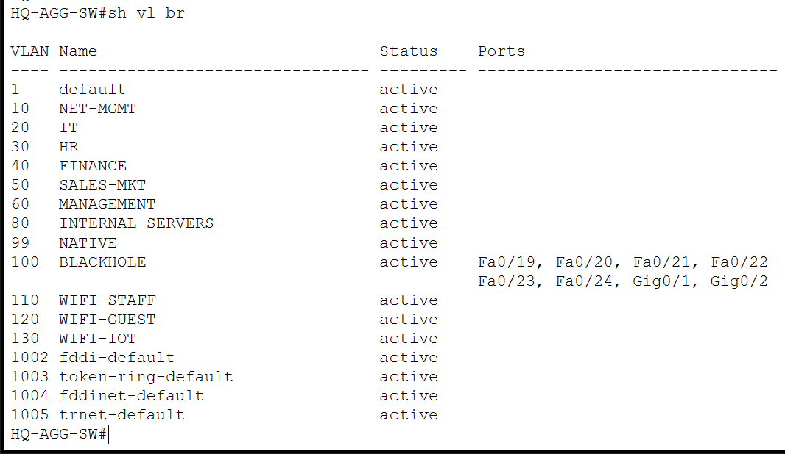
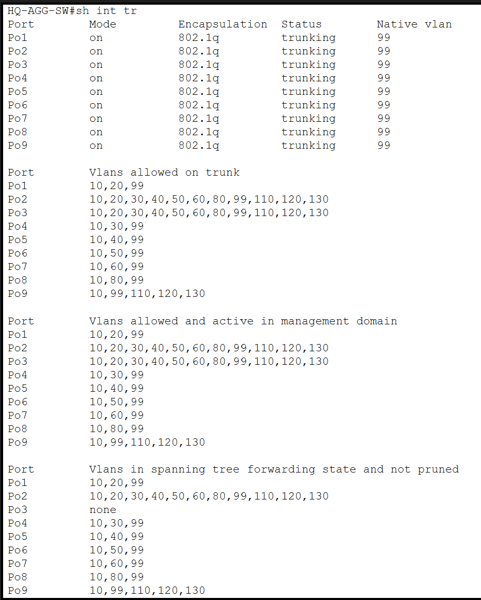
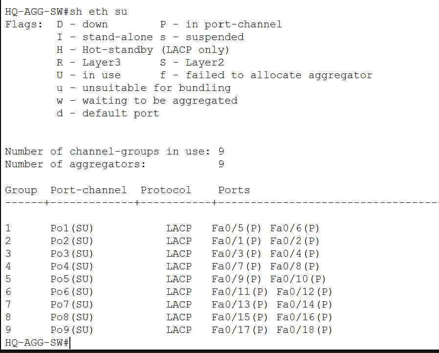
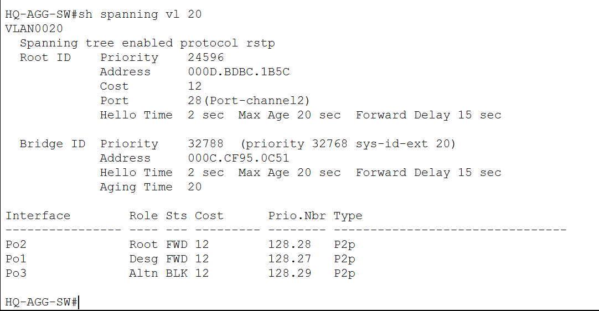
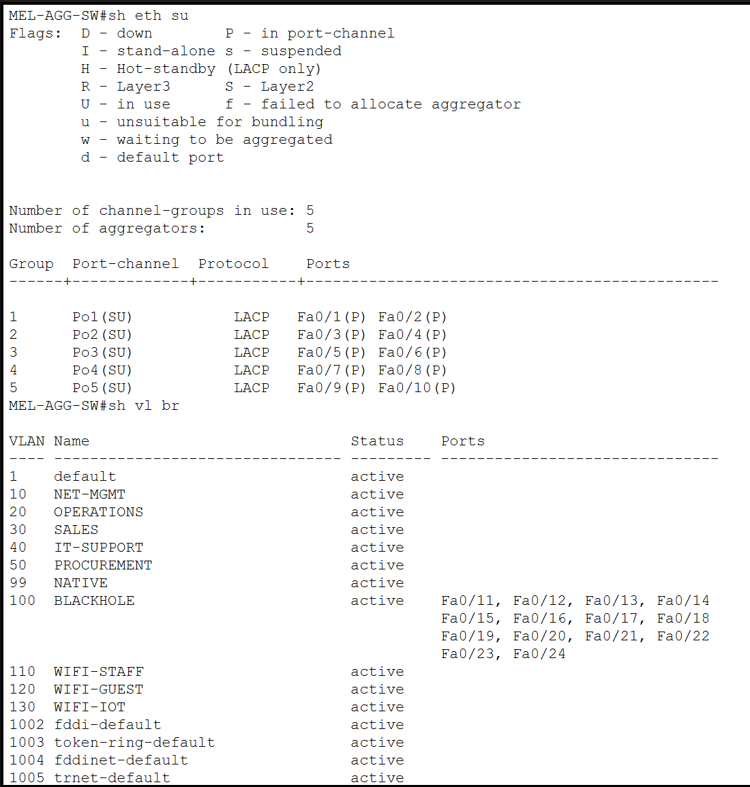
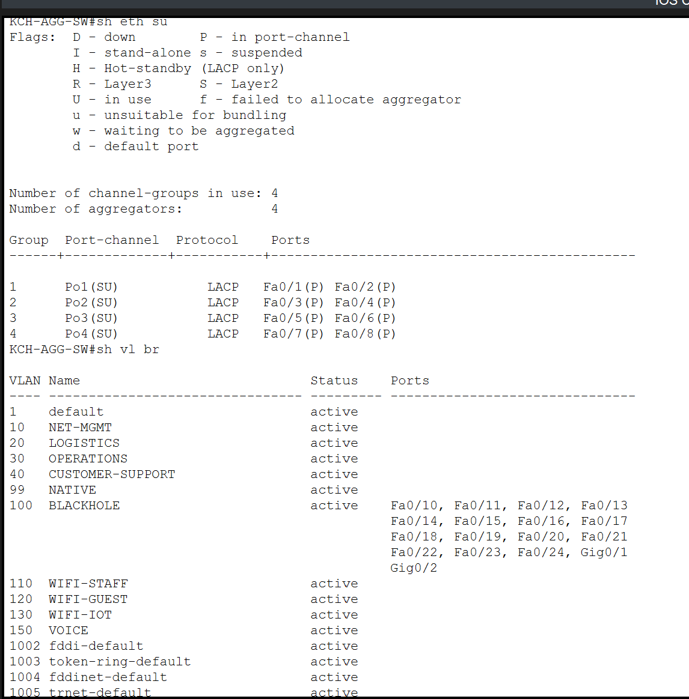

# Layer 2 Design

## Overview

The Layer 2 design provides segmentation, link redundancy, loop prevention, and basic access-layer protection across the enterprise network.

The implementation combines:

- VLAN-based segmentation
- IEEE 802.1Q trunking
- LACP EtherChannel
- Rapid-PVST
- Native and blackhole VLANs
- Port Security
- Shutdown of unused switch ports

Headquarters uses the most redundant Layer 2 design, while the branch sites use smaller aggregation and access-layer structures appropriate to their size.

---

# VLAN Segmentation

VLANs are used to separate departments, infrastructure, wireless users, IoT devices, servers, voice traffic, and management functions.

At Headquarters, the switching infrastructure carries multiple enterprise VLANs including:

- Network Management
- IT
- Human Resources
- Finance
- Sales / Marketing
- Management
- Internal Servers
- Staff Wi-Fi
- Guest Wi-Fi
- IoT
- Native VLAN
- Blackhole VLAN

The VLAN design provides logical separation between different user groups while allowing Layer 3 policies to control communication between them.

The complete VLAN and subnet allocation is documented in:

[IP Addressing and VLAN Design](02-ip-addressing-vlans.md)

---

# 802.1Q Trunking

Trunk links are used between switches to transport multiple VLANs across the Layer 2 infrastructure.

The trunk design uses:

- **VLAN 99** as the native VLAN
- Explicit VLAN allow-lists
- VLAN 100 reserved for unused ports rather than normal trunk traffic

Using explicit allowed VLANs reduces unnecessary VLAN propagation and keeps trunk configuration aligned with the intended network design.

---

# LACP EtherChannel

Headquarters uses multiple parallel switch links bundled through **LACP EtherChannel**.

This provides two main advantages:

1. Increased logical link capacity
2. Link redundancy if one physical member fails

The central HQ switching design includes EtherChannels between:

- Distribution switches
- Distribution and aggregation layers
- Aggregation and departmental access switches

LACP was configured using active negotiation rather than static channel configuration.

The EtherChannel design allows Spanning Tree to treat each bundle as a single logical interface while still benefiting from multiple physical links.

---

# Rapid-PVST

Rapid-PVST is enabled across the enterprise switching environment to provide Layer 2 loop prevention and faster convergence than traditional STP.

At Headquarters:

- **HQ-DSW1** is configured as the preferred STP root
- **HQ-DSW2** provides the secondary root role

The screenshot demonstrates the active root path and an alternate blocked path, confirming that redundant Layer 2 connectivity exists without creating a forwarding loop.

This design complements EtherChannel:

- EtherChannel bundles parallel links into one logical path.
- Rapid-PVST handles redundant logical paths between switches.

Together, they provide both redundancy and loop protection.

---

# Native and Blackhole VLANs

Two infrastructure VLANs are used consistently in the switching design.

## VLAN 99 — Native VLAN

VLAN 99 is used as the native VLAN on relevant trunk links instead of relying on the default VLAN 1.

This makes the trunk configuration more explicit and separates native traffic from normal user VLANs.

## VLAN 100 — Blackhole VLAN

Unused access ports are assigned to VLAN 100 and administratively shut down.

This prevents unused physical interfaces from remaining immediately available for normal network access.

The blackhole VLAN is not used as an end-user network.

---

# Port Security

Port Security is configured on selected access interfaces to limit the number of MAC addresses that can be learned on a port.

The implementation uses:

- Sticky MAC learning
- Restricted MAC address count
- `restrict` violation mode
- Different maximum values depending on the endpoint type

The screenshot also shows unused interfaces placed into the blackhole VLAN and administratively disabled.

A detailed access-port example is shown below:

For a normal workstation port, the expected behavior is:

- Maximum of one learned MAC address
- Sticky learning enabled
- Violation action set to restrict

At Kuching, ports carrying both an IP phone and a connected workstation were configured with a maximum of two MAC addresses to support both devices.

This distinction was important because a phone-plus-PC access port naturally presents more than one MAC address.

---

# Melaka Layer 2 Design

Melaka uses an aggregation switch connected to departmental access switches.

The branch Layer 2 design includes:

- Departmental VLAN segmentation
- Trunk connectivity
- LACP-based aggregated links
- Native VLAN 99
- Blackhole VLAN 100

The smaller topology provides the same segmentation principles as Headquarters without reproducing the full HQ distribution architecture.

Layer 3 gateway redundancy at Melaka is provided by the branch routers and is documented separately in:

[Routing and Redundancy](04-routing-redundancy.md)

---

# Kuching Layer 2 Design

Kuching also uses an aggregation/access switching structure.

Its Layer 2 design supports:

- Data VLANs
- Wireless VLANs
- IoT VLAN
- Management VLAN
- Voice VLAN
- Trunk links toward the branch router
- LACP aggregation between switching devices

The Voice VLAN is used by the local Cisco CME deployment and is discussed further in:

[Wireless, IoT and VoIP](07-wireless-iot-voip.md)

---

# Design Rationale

The Layer 2 design follows several consistent principles across all sites:

### Segmentation

Different departments and service types are assigned to separate VLANs instead of sharing one broadcast domain.

### Redundancy

Where multiple physical links are available, LACP EtherChannel is used to provide resilient connectivity.

### Loop Prevention

Rapid-PVST controls redundant Layer 2 paths and prevents switching loops.

### Access-Layer Protection

Unused switch ports are disabled and assigned to a blackhole VLAN, while active access ports use Port Security where appropriate.

### Consistent Infrastructure VLANs

VLAN 99 and VLAN 100 are reused across the sites for native and blackhole functions, providing a consistent operational model.

---

# Validation

The Layer 2 implementation was validated using Cisco IOS verification commands including:

- `show vlan brief`
- `show interfaces trunk`
- `show etherchannel summary`
- `show spanning-tree`
- `show port-security`
- `show port-security interface`
- `show interfaces status`

The screenshots above show the operational state of these features rather than configuration commands alone.

---

## Related Documentation

- [IP Addressing and VLAN Design](02-ip-addressing-vlans.md)
- [Routing and Redundancy](04-routing-redundancy.md)
- [Wireless, IoT and VoIP](07-wireless-iot-voip.md)
- [Security](09-security.md)
