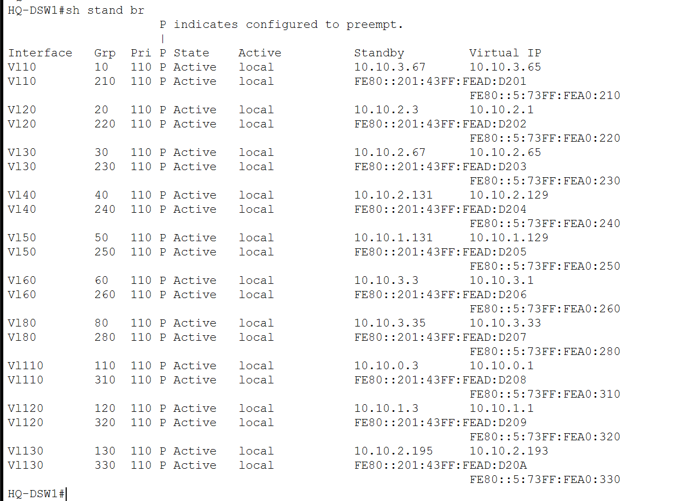
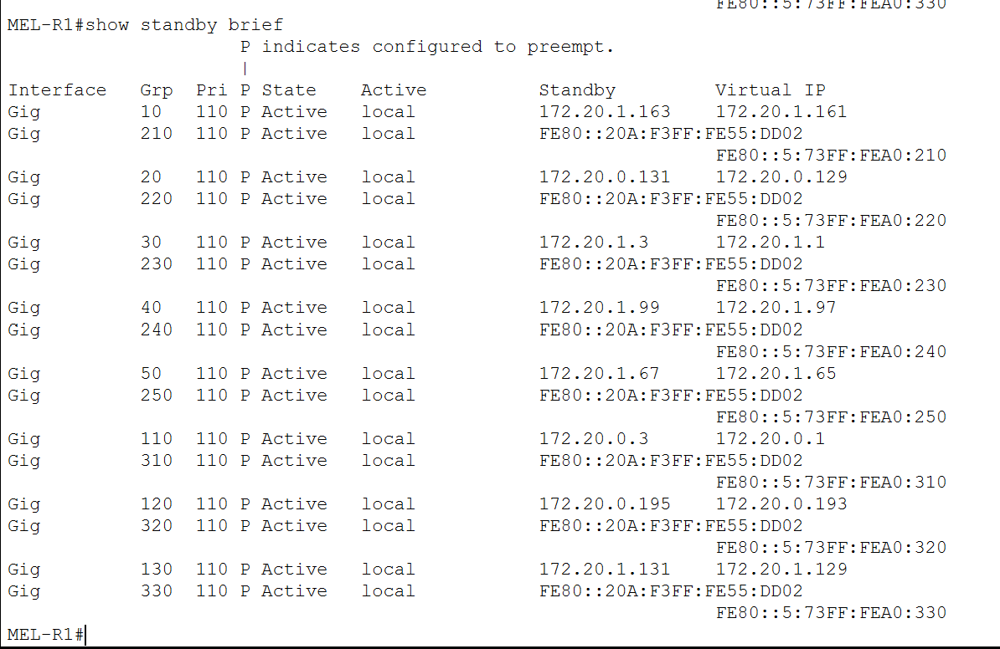
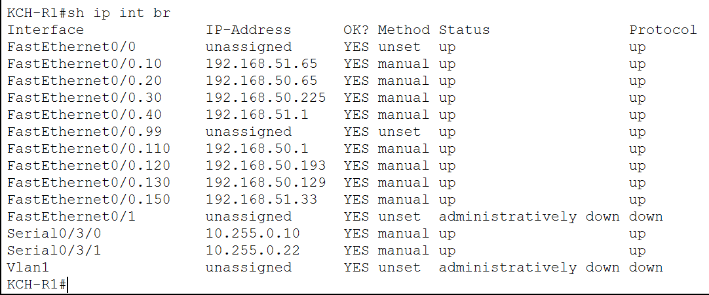

# Routing and Redundancy

## Overview

The enterprise routing design combines several Layer 3 approaches across the three sites.

The implementation includes:

- Inter-VLAN routing
- Router-on-a-Stick
- HSRP gateway redundancy
- OSPFv2 dynamic routing
- A centralized corporate WAN
- A higher-cost backup branch path

The design intentionally uses different routing models at Headquarters, Melaka, and Kuching to demonstrate multiple enterprise networking approaches within one integrated topology.

---

# Headquarters Routing

Headquarters uses multilayer switching for most internal VLAN routing.

The two distribution switches provide:

- Switched Virtual Interfaces (SVIs)
- Inter-VLAN routing
- HSRP virtual gateways
- Connectivity toward the HQ router and corporate WAN

This allows end devices to use a resilient default gateway even if one distribution switch becomes unavailable.

## HQ HSRP



HQ-DSW1 is configured as the preferred HSRP device, while HQ-DSW2 provides standby gateway redundancy.

The design uses:

- HQ-DSW1 priority `110`
- HQ-DSW2 priority `100`
- HSRP preemption
- Shared virtual gateway addresses for the user VLANs

If the active distribution switch becomes unavailable, the standby switch can assume the virtual gateway role.

This prevents end devices from requiring a gateway change during a first-hop failure.

---

# Melaka Routing and HSRP

Melaka uses a redundant Router-on-a-Stick design.

Two branch routers provide VLAN gateways through 802.1Q subinterfaces while HSRP provides a shared virtual gateway for each VLAN.



The branch design uses:

- MEL-R1 as the preferred HSRP router
- MEL-R2 as the standby router
- Priority `110` on MEL-R1
- Priority `100` on MEL-R2
- HSRP preemption
- IPv4 and IPv6 gateway redundancy

A separate Melaka WAN router connects the branch routing layer to the corporate WAN.

This design provides local default-gateway redundancy while keeping WAN routing logically separated from the user-facing VLAN gateways.

---

# Kuching Router-on-a-Stick

Kuching uses a simpler branch design centered around a single Cisco 2811 router.



The router provides inter-VLAN routing through subinterfaces for:

- Management
- Logistics
- Operations
- Support
- Staff Wi-Fi
- Guest Wi-Fi
- IoT
- Voice

Unlike HQ and Melaka, Kuching does not use HSRP for its local VLAN gateways.

This creates a deliberately simpler architecture while still demonstrating Router-on-a-Stick routing, dynamic WAN routing, wireless segmentation, and VoIP integration.

---

# OSPFv2 Corporate Routing

OSPFv2 is used as the internal dynamic routing protocol for IPv4 connectivity between the enterprise sites.

The routed infrastructure operates in:

`OSPF Area 0`

OSPF is used between:

- Headquarters
- Central WAN router
- Melaka
- Kuching
- Internet edge transit infrastructure where required

## OSPF Neighbor Relationships


The neighbor table confirms that the expected OSPF adjacencies are established.

Dynamic routing removes the need to manually configure individual static routes for every remote VLAN.

When a site advertises its internal networks, other enterprise routers can automatically learn how to reach those prefixes.

---

## OSPF-Learned Routes


The routing table contains OSPF-learned networks from remote sites.

This validates that the routing process is not only forming neighbor relationships but is also successfully exchanging routes.

Because each site uses a distinct private IPv4 block, routes can be easily identified by location:

- HQ — `10.10.0.0/22`
- Melaka — `172.20.0.0/23`
- Kuching — `192.168.50.0/23`

The detailed subnet allocation is documented in:

[IP Addressing and VLAN Design](02-ip-addressing-vlans.md)

---

# Corporate WAN Design

The corporate WAN follows a hub-oriented design through the central WAN router.

The primary paths are:

- CORE ↔ HQ
- CORE ↔ Melaka
- CORE ↔ Kuching

This provides a central Layer 3 point for inter-site routing.

The main point-to-point IPv4 links are:

| WAN Link | Network |
|---|---|
| CORE ↔ HQ | `10.255.0.0/30` |
| CORE ↔ Melaka | `10.255.0.4/30` |
| CORE ↔ Kuching | `10.255.0.8/30` |

A separate branch-to-branch link exists between Melaka and Kuching.

---

# Backup WAN Path

Melaka and Kuching are connected through an additional WAN link:

`10.255.0.20/30`

This path is not intended to replace the normal central WAN during normal operation.

Instead, it is configured with a higher OSPF cost.


The backup interface uses an OSPF cost of:

`200`

As a result, OSPF prefers the normal path through the central WAN router while keeping the Melaka–Kuching path available as an alternative.

The routing logic is therefore:

```text
Normal operation:

Melaka
   |
   v
CORE-WAN-R1
   |
   v
Kuching


Backup condition:

Melaka
   |
   +--------------------> Kuching
        Higher OSPF cost
```

This demonstrates route preference rather than simple physical redundancy.

---

# Routing Design by Site

| Site | Local Routing Model | Gateway Redundancy | WAN Routing |
|---|---|---|---|
| Headquarters | Multilayer switching | HSRP | OSPFv2 |
| Melaka | Redundant Router-on-a-Stick | HSRP | OSPFv2 |
| Kuching | Single Router-on-a-Stick | None | OSPFv2 |

The different models were intentionally retained instead of making all three sites identical.

This makes the project useful for comparing different enterprise routing approaches.

---

# Separation of Routing Responsibilities

The architecture separates several routing functions.

### Local VLAN Routing

Provides communication between VLANs within each site.

### First-Hop Redundancy

HSRP provides resilient virtual default gateways at HQ and Melaka.

### Enterprise WAN Routing

OSPF dynamically exchanges internal IPv4 routes between sites.

### Internet Routing

eBGP is used separately at the Internet edge and is documented in:

[DMZ and Internet Edge](08-dmz-internet-edge.md)

### IPv6 Routing

OSPFv3 is used for IPv6 and is documented separately in:

[IPv6 Design](05-ipv6.md)

---

# Validation

The routing implementation was validated using commands including:

- `show standby brief`
- `show ip interface brief`
- `show ip ospf neighbor`
- `show ip route ospf`
- `show ip ospf interface`

The screenshots demonstrate:

- Active and standby HSRP states
- Router-on-a-Stick interfaces
- Full OSPF neighbor relationships
- Dynamically learned OSPF routes
- Higher OSPF cost on the backup branch link

---

## Related Documentation

- [Network Architecture](01-architecture.md)
- [IP Addressing and VLAN Design](02-ip-addressing-vlans.md)
- [Layer 2 Design](03-layer2-design.md)
- [IPv6 Design](05-ipv6.md)
- [DMZ and Internet Edge](08-dmz-internet-edge.md)
