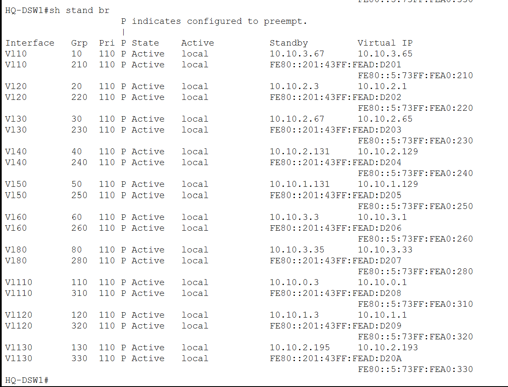
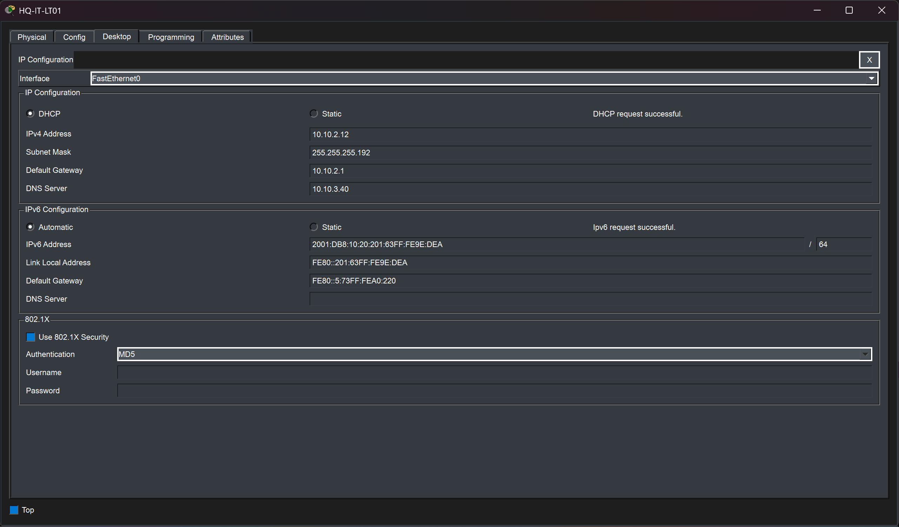
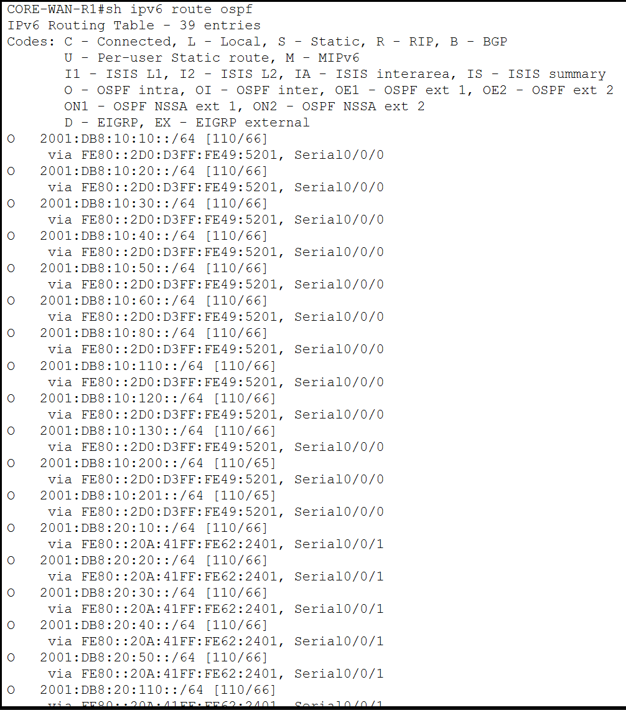

# IPv6 Design

## Overview

The enterprise network was designed as a dual-stack environment supporting both IPv4 and IPv6.

IPv6 is implemented across Headquarters, Melaka, Kuching, and the corporate WAN rather than being limited to a single isolated test segment.

The IPv6 design includes:

- One `/64` prefix per VLAN
- Site-level `/48` address blocks
- IPv6 inter-VLAN routing
- HSRP for IPv6 at redundant sites
- OSPFv3 dynamic routing
- SLAAC for end-device addressing
- Inter-site IPv6 connectivity

The IPv6 deployment mirrors the logical structure of the IPv4 network while using native IPv6 routing mechanisms.

---

# Site Addressing

Each enterprise location receives its own IPv6 `/48` block.

| Site | IPv6 Address Space |
|---|---|
| Headquarters | `2001:DB8:10::/48` |
| Melaka | `2001:DB8:20::/48` |
| Kuching | `2001:DB8:30::/48` |
| Corporate WAN | `2001:DB8:FF::/48` |

Individual VLANs use separate `/64` prefixes.

For example:

- HQ VLAN 20 uses `2001:DB8:10:20::/64`
- Melaka VLAN 20 uses `2001:DB8:20:20::/64`
- Kuching VLAN 20 uses `2001:DB8:30:20::/64`

The complete per-VLAN addressing plan is documented in:

[IP Addressing and VLAN Design](02-ip-addressing-vlans.md)

---

# IPv6 Gateway Redundancy

IPv6 gateway redundancy is implemented at Headquarters and Melaka.

These sites already use redundant Layer 3 devices for IPv4, so the same design principle was extended to IPv6.

## Headquarters HSRPv6

The HQ distribution switches provide redundant IPv6 gateways for the enterprise VLANs.

The design uses:

- HQ-DSW1 as the preferred device
- HQ-DSW2 as the standby device
- Separate HSRP groups for IPv4 and IPv6
- IPv6 addresses configured on the SVIs

This allows hosts to retain IPv6 gateway availability if one distribution switch becomes unavailable.

The same `show standby brief` output also demonstrates that IPv4 and IPv6 first-hop redundancy operate together on the HQ distribution layer.

---

# SLAAC Address Assignment

End devices receive IPv6 addresses through Stateless Address Autoconfiguration.

With SLAAC, an IPv6-capable client can automatically learn:

- Its IPv6 network prefix
- Its IPv6 address
- Its default gateway

This reduces the need to manually configure IPv6 addresses on every endpoint.

IPv4 addressing continues to use DHCP where appropriate, allowing endpoints to operate in dual-stack mode.

The result is a client that can communicate using both protocol families at the same time.

---

# OSPFv3 Dynamic Routing

OSPFv3 is used to exchange IPv6 routes between the enterprise sites.

The protocol runs alongside OSPFv2:

- OSPFv2 carries IPv4 routing information
- OSPFv3 carries IPv6 routing information

This keeps the routing design consistent across both protocol families.

## OSPFv3 Neighbors

The neighbor table confirms that IPv6 routing adjacencies are successfully formed across the WAN.

Established OSPFv3 relationships allow each site to dynamically learn the IPv6 networks advertised by the other locations.

---

## IPv6 Routing Table

The IPv6 routing table contains routes learned through OSPFv3.

This confirms that the routers are not only forming adjacencies but are also exchanging usable IPv6 prefixes.

The learned routes provide connectivity between the different site address spaces:

- `2001:DB8:10::/48`
- `2001:DB8:20::/48`
- `2001:DB8:30::/48`

WAN transit links use prefixes from the dedicated corporate WAN IPv6 block.

---

# Inter-Site IPv6 Connectivity

IPv6 connectivity was tested between endpoints and gateways located at different enterprise sites.

The validation confirms that traffic can traverse the IPv6 WAN between Headquarters and the branch networks.

Successful inter-site communication demonstrates the combined operation of:

- IPv6 addressing
- VLAN gateway configuration
- OSPFv3
- WAN routing
- Dual-stack endpoint configuration

This provides an end-to-end validation rather than only verifying individual router interfaces.

---

# Dual-Stack Operation

IPv4 and IPv6 operate simultaneously throughout the enterprise.

This allows the project to retain traditional IPv4 services while demonstrating IPv6 deployment across the same infrastructure.

A typical dual-stack endpoint therefore has:

- An IPv4 address and IPv4 default gateway
- An IPv6 `/64` address
- An IPv6 default gateway
- Access to dynamically learned IPv4 and IPv6 routes

The routing infrastructure maintains separate control-plane processes for the two protocol families while using the same physical network.

---

# IPv6 Design by Site

| Site | IPv6 Gateway Model | WAN Routing |
|---|---|---|
| Headquarters | Multilayer switching with HSRPv6 | OSPFv3 |
| Melaka | Redundant Router-on-a-Stick with HSRPv6 | OSPFv3 |
| Kuching | Single Router-on-a-Stick | OSPFv3 |

The IPv6 architecture therefore follows the same overall site design philosophy as IPv4.

HQ and Melaka provide first-hop redundancy, while Kuching uses a simpler single-router gateway design.

---

# Packet Tracer Implementation Note

The HQ multilayer switches required an IPv4/IPv6-capable SDM template before full IPv6 Layer 3 functionality could be used.

After applying the appropriate template, the switches required a reload before IPv6 routing and HSRP for IPv6 could operate correctly.

This behavior is specific to the simulated Cisco switch platform used in the project and is discussed further in:

[Testing and Packet Tracer Limitations](10-testing-limitations.md)

---

# Validation

The IPv6 implementation was validated using:

- `show standby brief`
- `show ipv6 interface`
- `show ipv6 ospf neighbor`
- `show ipv6 route ospf`
- IPv6 endpoint configuration
- End-to-end IPv6 ping tests

The collected evidence confirms:

- IPv6 addressing on enterprise VLANs
- SLAAC operation
- HSRPv6 redundancy
- OSPFv3 neighbor formation
- Dynamic IPv6 route exchange
- Successful inter-site IPv6 communication

---

## Related Documentation

- [Network Architecture](01-architecture.md)
- [IP Addressing and VLAN Design](02-ip-addressing-vlans.md)
- [Routing and Redundancy](04-routing-redundancy.md)
- [Testing and Packet Tracer Limitations](10-testing-limitations.md)
