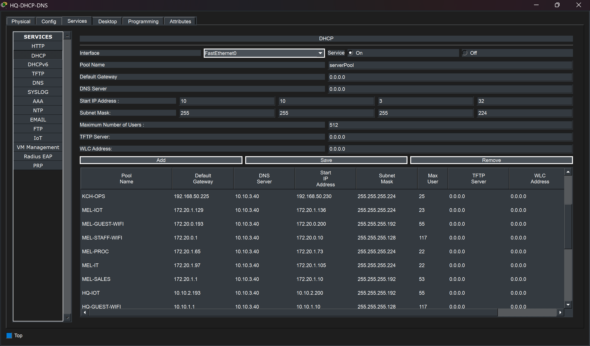
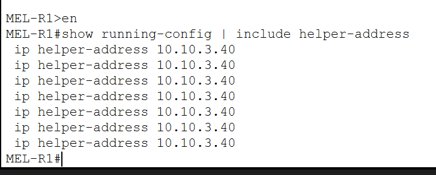
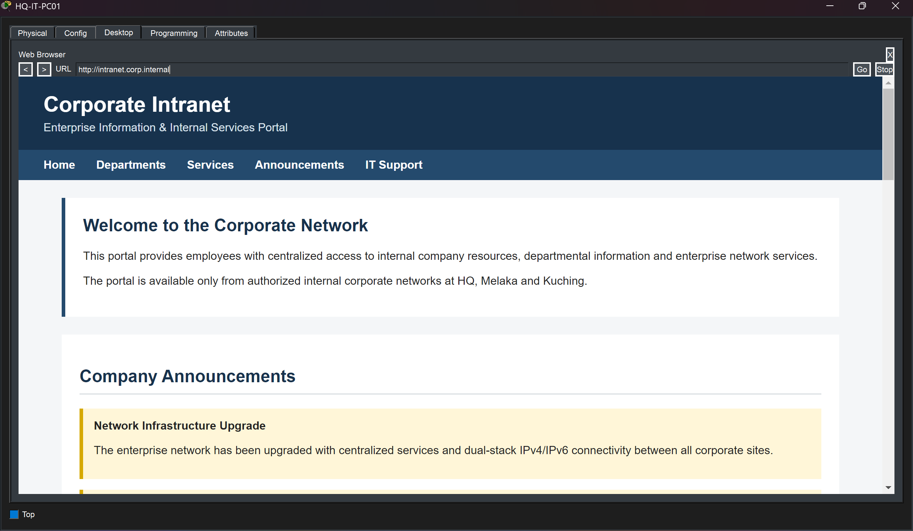
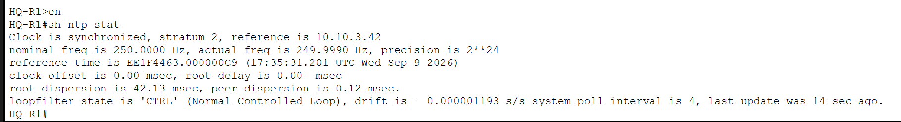
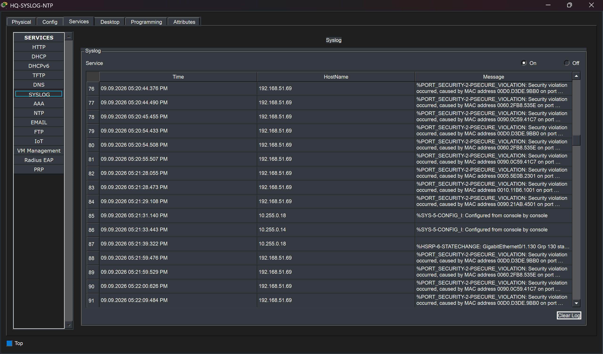

# Network Services

## Overview

The enterprise uses centralized network services hosted at Headquarters to support users and devices across HQ, Melaka, and Kuching.

The main internal services include:

- DHCP
- Internal DNS
- NTP
- Syslog
- Corporate intranet
- AAA / RADIUS
- IoT registration

Most branch networks rely on these centralized services rather than deploying separate infrastructure at every site.

The main internal service addresses are:

| Service | IPv4 Address |
|---|---|
| DHCP / Internal DNS | `10.10.3.40` |
| AAA / RADIUS | `10.10.3.41` |
| Syslog / NTP | `10.10.3.42` |
| Corporate Intranet | `10.10.3.43` |
| IoT Registration Server | `10.10.3.44` |

The AAA and IoT services are discussed in more detail in their respective security and IoT sections.

---

# Centralized DHCP

A centralized DHCP service is hosted at Headquarters on `10.10.3.40`.

The server contains address pools for multiple VLANs located across the three enterprise sites.



Each DHCP pool defines the information required by its corresponding client network, including:

- IPv4 address range
- Subnet mask
- Default gateway
- Internal DNS server

Using a centralized DHCP server reduces the need to maintain a separate DHCP server at each branch.

The exception is the Kuching Voice VLAN, where DHCP is provided locally by the CME router because IP phones require local Option 150 information.

---

# DHCP Relay

Because DHCP broadcasts do not normally cross routers, routed VLAN interfaces use DHCP relay to forward client requests toward the central DHCP server.

The relay destination is:

`10.10.3.40`

For example, the Melaka routing infrastructure forwards DHCP requests from its routed VLANs to Headquarters.



The repeated `ip helper-address 10.10.3.40` entries correspond to the routed branch VLAN interfaces that depend on the centralized DHCP service.

This allows a client located at a remote site to obtain an address from the HQ DHCP server even though the client and server are separated by Layer 3 routing.

---

# Remote DHCP Validation

DHCP functionality was validated from a client at the Kuching branch.


The client successfully received:

- IPv4 address: `192.168.50.71`
- Subnet mask: `255.255.255.192`
- Default gateway: `192.168.50.65`
- DNS server: `10.10.3.40`

The same endpoint also received IPv6 configuration automatically, demonstrating simultaneous IPv4 DHCP and IPv6 SLAAC operation.

This test confirms that the following components work together:

- Central DHCP pools
- DHCP relay
- Inter-site routing
- Branch VLAN gateway configuration
- Central DNS distribution

---

# Internal DNS

The server at `10.10.3.40` also provides internal DNS resolution.

Internal clients use the corporate DNS service rather than the public DNS view used by external Internet clients.

For example, the internal name:

`www.corp.com`

resolves to the private DMZ web server address:

`10.10.3.100`


This allows internal users to reach corporate services using meaningful hostnames instead of manually entering IP addresses.

The project also uses the internal namespace:

`corp.internal`

for services intended only for enterprise users.

Public DNS and external name resolution are documented separately in:

[DMZ and Internet Edge](08-dmz-internet-edge.md)

---

# Corporate Intranet

An internal web server is hosted at:

`10.10.3.43`

and is accessible through:

`intranet.corp.internal`



The intranet represents an internal-only corporate service available to enterprise users.

Its presence demonstrates that the network supports both:

- Public-facing services in the DMZ
- Internal-only services hosted on the enterprise server network

This separation helps distinguish services intended for employees from services exposed toward the Internet.

---

# Network Time Protocol

A centralized NTP service is hosted on:

`10.10.3.42`

Network devices use this server as a common time reference.



The validation output confirms that the HQ router is synchronized and reports:

- Clock synchronized
- Stratum 2
- Reference server `10.10.3.42`

Consistent time synchronization is important for:

- Syslog event correlation
- Troubleshooting
- Security monitoring
- Comparing events across different network devices

---

# Centralized Syslog

The same infrastructure server at `10.10.3.42` also provides centralized Syslog collection.



The log server receives operational and security-related events from network devices.

The captured events include examples such as:

- Port Security violations
- HSRP state changes
- Device configuration events

Centralized logging provides a single location for reviewing events generated throughout the enterprise instead of inspecting each router or switch individually.

This is especially useful when troubleshooting events that involve multiple devices or sites.

---

# Service Centralization

The overall service architecture follows a centralized model:

```text
                    Headquarters
               Internal Services VLAN
                        |
        +---------------+---------------+
        |               |               |
     DHCP/DNS        Syslog/NTP       Intranet
     10.10.3.40       10.10.3.42      10.10.3.43
        |
        |
   Corporate WAN
     /         \
    /           \
Melaka         Kuching
Clients         Clients
```

Remote clients reach these services through the enterprise routing infrastructure.

This design avoids unnecessary duplication of infrastructure while still allowing all three locations to consume shared services.

---

# Internal and External Service Separation

The project separates internal infrastructure services from public-facing services.

## Internal Services

Hosted on the internal server network:

- DHCP
- Internal DNS
- AAA / RADIUS
- NTP
- Syslog
- Intranet
- IoT registration

## Public Services

Hosted in the DMZ:

- Public Web
- Public DNS
- FTP
- Mail

This distinction prevents public services from being placed directly inside the internal server segment.

The DMZ service architecture is documented in:

[DMZ and Internet Edge](08-dmz-internet-edge.md)

---

# DNS Design

The environment uses different DNS behavior depending on where the client is located.

### Internal Client

An enterprise client querying:

`www.corp.com`

receives:

`10.10.3.100`

This directs internal users toward the private DMZ address.

### External Client

An Internet-side client resolves the same public service through the external DNS service and receives the published public address.

This provides a basic split-DNS design in the simulated enterprise environment.

---

# Service Dependency Model

Several enterprise features depend on the centralized service infrastructure.

For example:

| Feature | Central Service Used |
|---|---|
| User IPv4 addressing | DHCP |
| Hostname resolution | DNS |
| Device timestamps | NTP |
| Central event monitoring | Syslog |
| Secure device login | AAA / RADIUS |
| IoT device registration | IoT Server |
| Internal employee portal | Intranet |

This means the service layer is integrated with the routing, security, wireless, and IoT components of the project rather than operating as an isolated server demonstration.

---

# Validation

The centralized services were validated using several methods:

- Reviewing configured DHCP pools
- Verifying `ip helper-address` relay configuration
- Obtaining DHCP addressing from a remote branch client
- Resolving internal DNS records using `nslookup`
- Accessing the corporate intranet through DNS
- Verifying NTP synchronization
- Reviewing centrally collected Syslog events

The screenshots demonstrate functional service delivery rather than configuration alone.

---

## Related Documentation

- [Network Architecture](01-architecture.md)
- [IP Addressing and VLAN Design](02-ip-addressing-vlans.md)
- [Routing and Redundancy](04-routing-redundancy.md)
- [IPv6 Design](05-ipv6.md)
- [Wireless, IoT and VoIP](07-wireless-iot-voip.md)
- [DMZ and Internet Edge](08-dmz-internet-edge.md)
- [Security](09-security.md)
