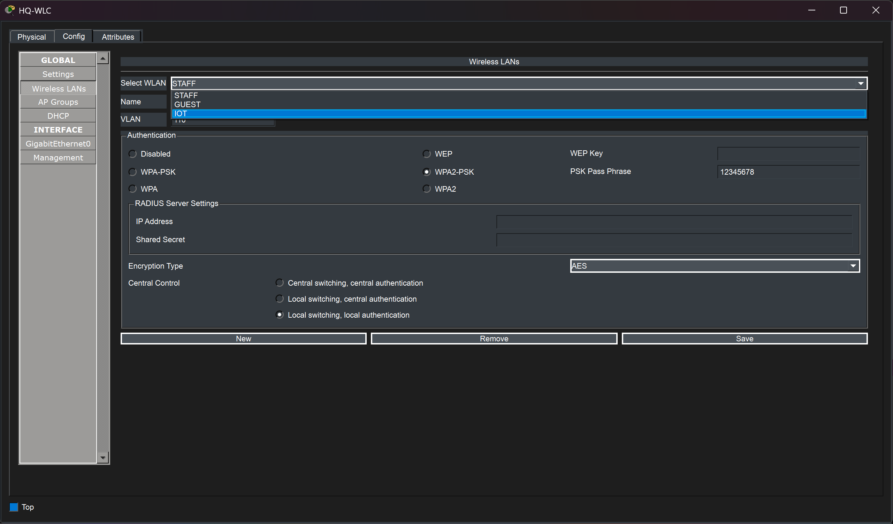
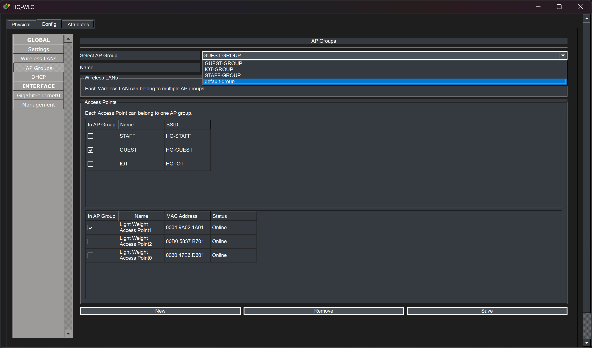
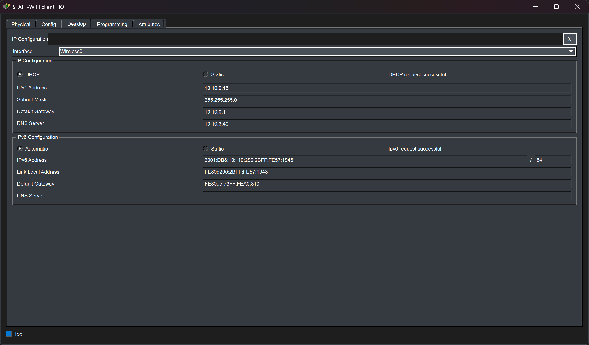
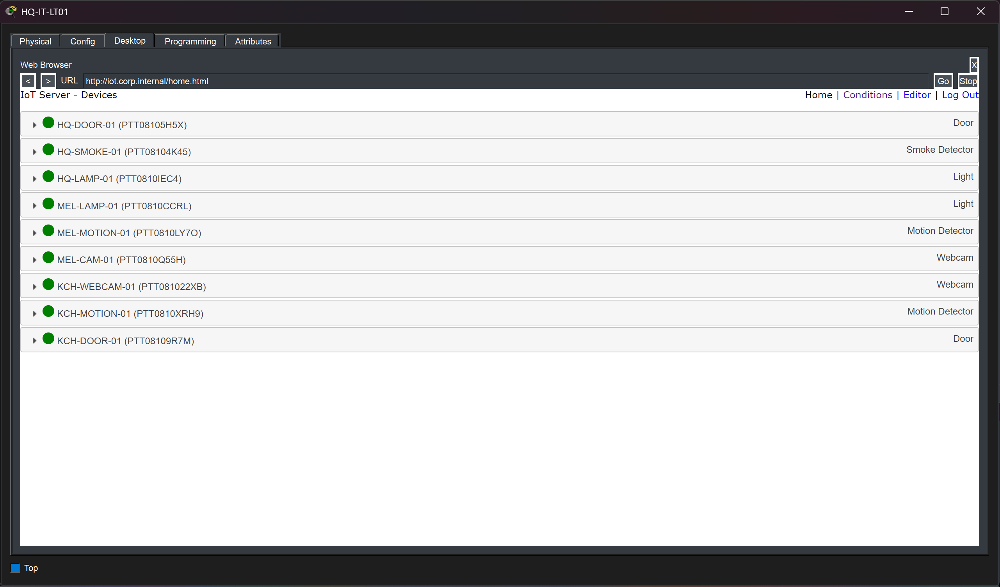
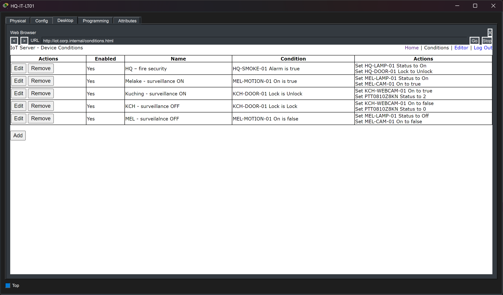
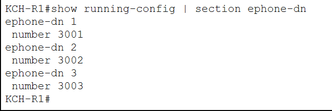
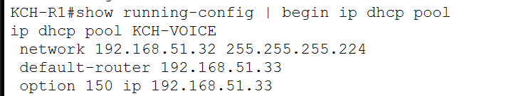
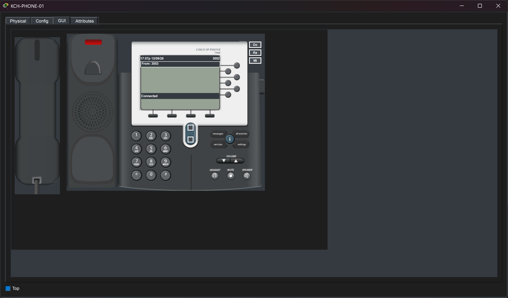

# Wireless, IoT and VoIP

## Overview

The enterprise integrates three additional service domains into the same routed infrastructure:

- Corporate wireless networking
- IoT device connectivity and automation
- Voice over IP at the Kuching branch

These services are logically separated using dedicated VLANs and are integrated with the existing DHCP, DNS, routing, security, and management infrastructure.

---

# Wireless Architecture

Wireless access is provided through a Wireless LAN Controller (WLC) and lightweight access points.

At Headquarters, the wireless design separates users into three logical networks:

- Staff Wi-Fi
- Guest Wi-Fi
- IoT Wi-Fi

Each WLAN is mapped to its corresponding VLAN.

| Wireless Network | VLAN |
|---|---:|
| Staff | 110 |
| Guest | 120 |
| IoT | 130 |

This keeps enterprise users, visitors, and IoT devices separated at Layer 2 and allows different security policies to be applied to each network.

---

# HQ Wireless LANs

The HQ WLC is configured with separate WLAN profiles for:

- HQ-STAFF
- HQ-GUEST
- HQ-IOT

The wireless networks use WPA2-PSK with AES in the Packet Tracer lab.

Local switching and local authentication were used because this mode provided the most reliable behavior in the simulated environment.

The three WLANs are mapped to their dedicated enterprise VLANs so that wireless traffic follows the same Layer 3 and security policies as wired traffic.

---

# Lightweight Access Points

The WLC manages three lightweight access points at Headquarters.

The access points are assigned to separate AP groups so that the wireless roles can be represented independently:

- Staff access
- Guest access
- IoT access

The screenshot confirms that the lightweight APs are registered and online.

Centralized wireless management allows WLAN configuration to be controlled from the WLC instead of configuring each access point individually.

---

# Staff Wireless Validation

The Staff wireless client successfully joins the Staff WLAN and receives network configuration from the enterprise infrastructure.

The captured client configuration demonstrates:

- IPv4 DHCP addressing
- Correct Staff VLAN gateway
- Central DNS server assignment
- IPv6 SLAAC addressing

This confirms that wireless traffic is successfully integrated with the central DHCP, DNS, IPv6, and routing services.

---

# Guest Wireless Validation

The Guest wireless client receives addressing from the dedicated Guest VLAN.

The Guest WLAN is intentionally separated from Staff and internal enterprise networks.

Security ACLs restrict guest access toward private enterprise resources while still permitting the network services required for connectivity.

The detailed Guest ACL policy is documented in:

[Security](09-security.md)

---

# IoT Architecture

IoT devices are placed into dedicated IoT VLANs rather than sharing normal user networks.

The enterprise uses a centralized IoT registration server located at Headquarters:

`10.10.3.44`

IoT devices from Headquarters, Melaka, and Kuching register with this service across the routed enterprise network.

This allows the project to demonstrate centralized IoT management across multiple locations.

---

# IoT Device Registration

The IoT registration interface shows devices from multiple enterprise sites successfully connected to the central IoT service.

Examples of connected device types include:

- Doors
- Lamps
- Motion detectors
- Cameras
- Smoke detection devices

This validates:

- IoT VLAN connectivity
- Inter-site routing
- Centralized IoT registration
- Communication between remote IoT networks and the HQ server

IoT traffic is restricted through dedicated ACLs so that IoT devices can reach required infrastructure services without receiving unrestricted access to internal networks.

---

# IoT Automation

The project also includes IoT automation rules.

Examples include:

### Headquarters

A smoke detection event can trigger actions such as:

- Turning on a lamp
- Unlocking a door

### Melaka

Motion detection can trigger:

- Lamp activation
- Camera activation

When motion is no longer detected, the associated devices can return to their normal state.

### Kuching

Door state changes can trigger:

- Camera activation
- Lighting actions

These rules demonstrate that the IoT component is not limited to simple device registration.

The IoT server is also used to coordinate actions between sensors and actuators.

---

# IoT Network Security

IoT devices are treated as less trusted than normal enterprise endpoints.

The IoT ACL policy allows access only to required centralized services such as:

- DHCP
- DNS
- NTP
- IoT registration server

Other internal access is denied.

This limits the ability of an IoT endpoint to communicate freely with internal departments or servers.

The detailed ACL implementation is documented in:

[Security](09-security.md)

---

# VoIP at Kuching

The Kuching branch includes a Cisco CallManager Express deployment using a Cisco 2811 router.

A dedicated voice VLAN is used:

| Function | Value |
|---|---|
| VLAN | `150` |
| Network | `192.168.51.32/27` |
| Gateway | `192.168.51.33` |
| CME Address | `192.168.51.33` |

Separating voice traffic from normal data networks provides a clearer logical design and allows the IP phones to use a dedicated addressing scope.

---

# Cisco CME Configuration

Cisco CME provides local call control for the Kuching IP phones.

The configured directory numbers include:

- `3001`
- `3002`
- `3003`

The extensions allow the Packet Tracer IP phones to place calls between devices inside the branch.

The 2811 platform was used because the Packet Tracer 2911 implementation did not provide the required CME functionality in this lab.

---

# Voice DHCP and Option 150

IP phones require information about the call-processing server during DHCP configuration.

Kuching therefore uses a local DHCP pool for the voice network.

The pool provides:

- Voice subnet information
- Default gateway
- DHCP Option 150

Option 150 points the phones toward:

`192.168.51.33`

which is also the local CME address.

This allows the phones to automatically discover the call-processing router after receiving their IP configuration.

---

# VoIP Call Validation

The phone interface confirms a successful call between configured Kuching extensions.

This validates the combined operation of:

- Voice VLAN
- Router-on-a-Stick
- Local DHCP
- Option 150
- Cisco CME
- Phone registration
- Extension configuration

The successful call confirms that the voice environment is functional rather than only statically configured.

---

# Service Integration

Wireless, IoT, and voice services all depend on the broader enterprise infrastructure.

For example:

| Feature | Infrastructure Dependency |
|---|---|
| Staff Wi-Fi | DHCP, DNS, VLAN routing |
| Guest Wi-Fi | DHCP, DNS, ACL security |
| IoT | DHCP, DNS, NTP, IoT server, ACLs |
| VoIP | Voice VLAN, local DHCP, CME |
| Wireless IPv6 | SLAAC, IPv6 routing |
| Remote IoT | OSPF inter-site routing |

This demonstrates that the additional services are integrated with the enterprise design rather than operating as isolated Packet Tracer features.

---

# Packet Tracer Wireless Note

The WLC implementation in Packet Tracer has several behavioral limitations compared with a production wireless controller.

During testing, centralized switching behavior was unreliable.

The final design therefore uses:

- Local switching
- Local authentication

This provided stable WLAN connectivity while preserving the intended VLAN segmentation and wireless roles.

The limitation is documented further in:

[Testing and Packet Tracer Limitations](10-testing-limitations.md)

---

# Validation

The wireless, IoT, and VoIP components were validated through:

- WLC WLAN configuration
- Lightweight AP registration
- Staff wireless client addressing
- Guest wireless client addressing
- IoT device registration
- IoT automation rules
- CME extension configuration
- Voice DHCP Option 150
- Successful IP phone call

The screenshots demonstrate end-to-end operation across all three service areas.

---

## Related Documentation

- [Network Architecture](01-architecture.md)
- [IP Addressing and VLAN Design](02-ip-addressing-vlans.md)
- [Routing and Redundancy](04-routing-redundancy.md)
- [IPv6 Design](05-ipv6.md)
- [Network Services](06-network-services.md)
- [Security](09-security.md)
- [Testing and Packet Tracer Limitations](10-testing-limitations.md)
