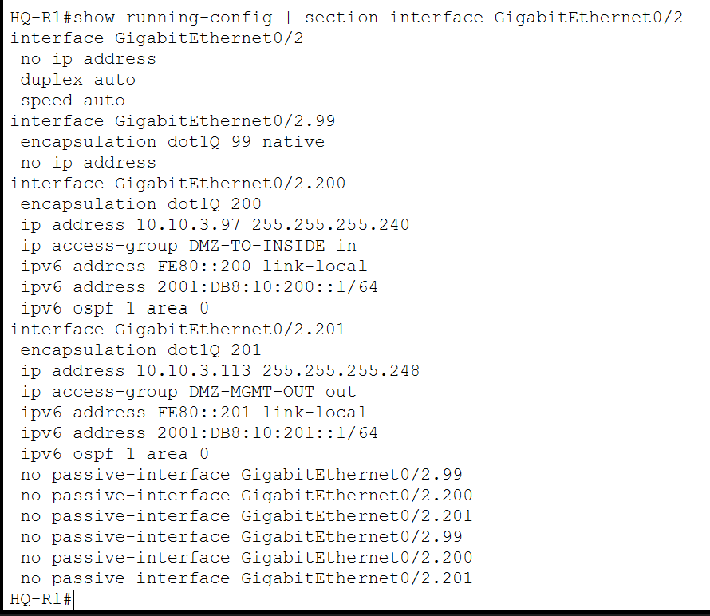
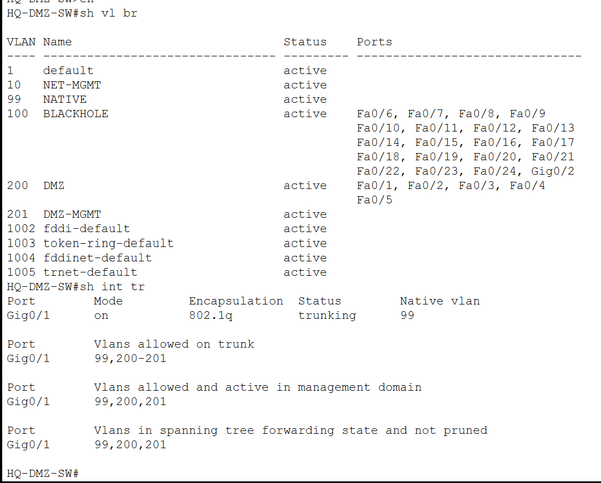
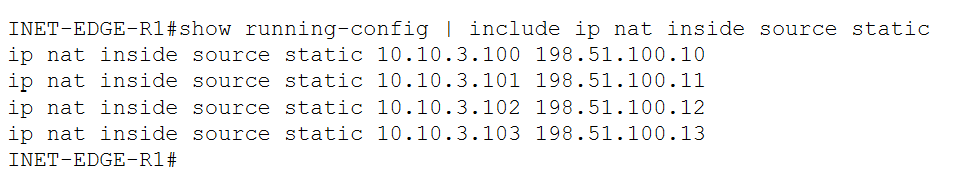
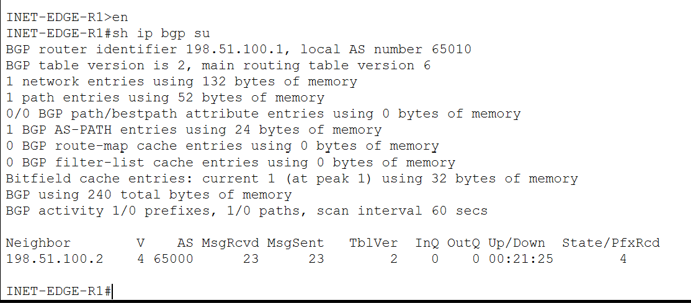
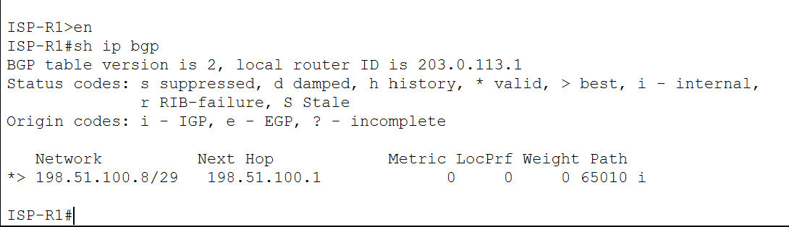
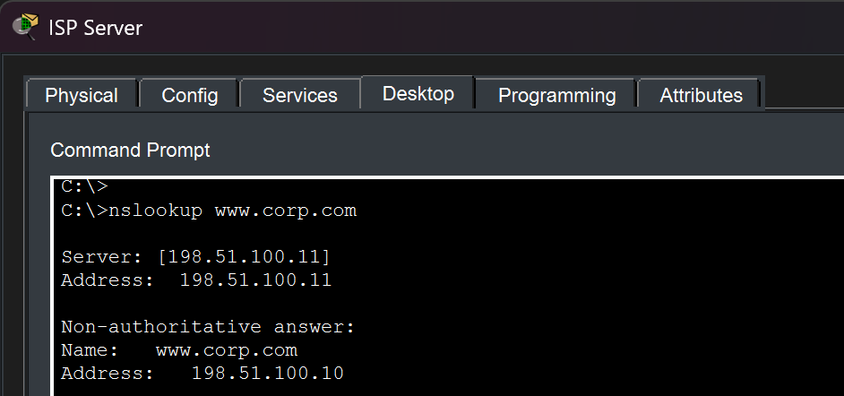
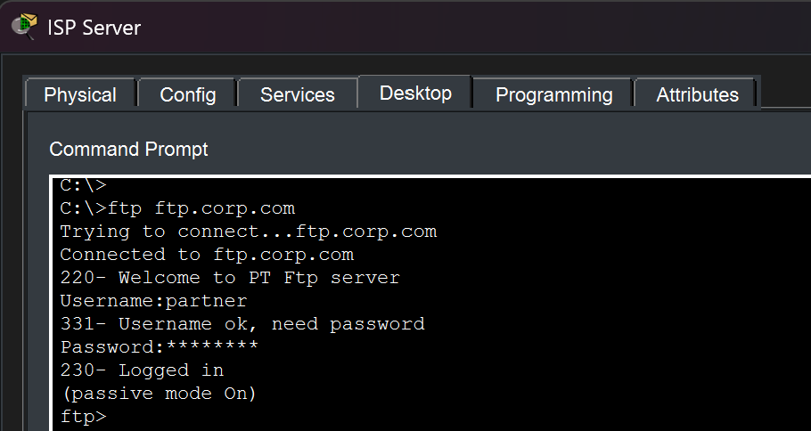
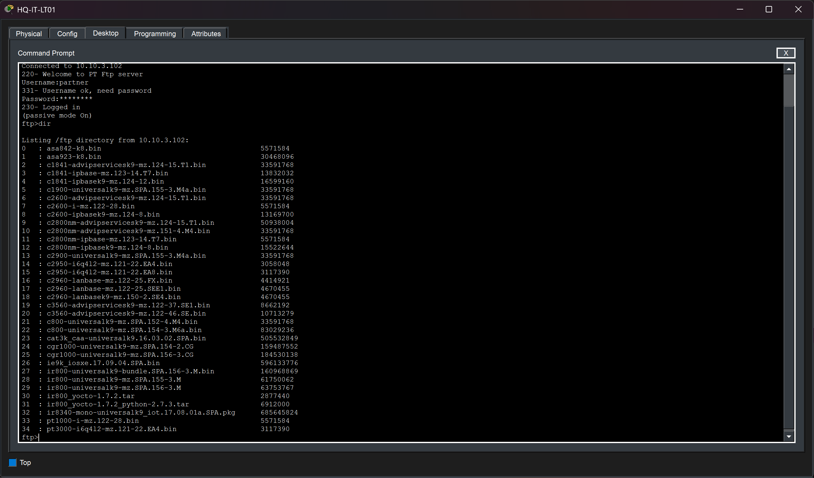
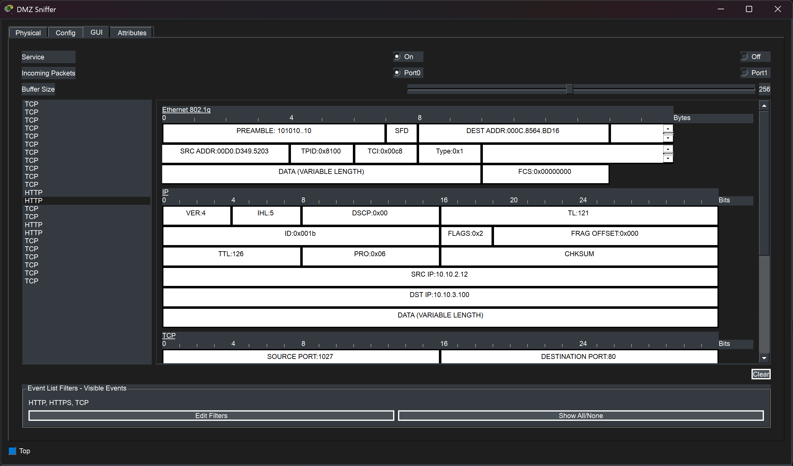

# DMZ and Internet Edge

## Overview

The enterprise Internet edge provides controlled connectivity between the internal corporate network, the public DMZ, and a simulated external ISP environment.

The design includes:

- Dedicated DMZ service and management VLANs
- Public-facing Web, DNS, FTP, and Mail services
- Static NAT for published services
- PAT for internal Internet access
- eBGP peering with a simulated ISP
- Public DNS resolution
- Internet connectivity validation
- Passive DMZ traffic monitoring
- DMZ-to-internal traffic restrictions
- An IOS IPS positioned between the Internet edge and the corporate WAN

The objective was to simulate the main components of a small enterprise perimeter rather than connecting the internal network directly to an ISP router.

---

# DMZ Architecture

The enterprise DMZ is connected to `HQ-R1` and is logically separated from the internal Headquarters networks.

Two VLANs are used:

| VLAN | Purpose | IPv4 Subnet | Gateway |
|---:|---|---|---|
| 200 | DMZ Services | `10.10.3.96/28` | `10.10.3.97` |
| 201 | DMZ Management | `10.10.3.112/29` | `10.10.3.113` |

VLAN 200 hosts the public-facing services, while VLAN 201 provides a separate management network.

---

# DMZ Router Subinterfaces



The DMZ connection uses Router-on-a-Stick on `HQ-R1`.

The router provides separate subinterfaces for:

- Native VLAN 99
- DMZ Services VLAN 200
- DMZ Management VLAN 201

The service and management networks therefore remain logically separated even though they share the same physical router connection.

The DMZ service interface also applies the policy used to restrict traffic initiated from public-facing servers toward internal enterprise networks.

---

# DMZ Switch Segmentation



The DMZ switch separates service and management traffic using VLANs.

The service VLAN contains the public-facing servers:

- Web
- DNS
- FTP
- Mail

The switch uplink to `HQ-R1` operates as an 802.1Q trunk carrying the required DMZ VLANs.

This prevents the DMZ from being implemented as one unsegmented external network.

---

# Public-Facing Services

The DMZ contains four public-facing servers.

| Service | Private Address | Public Address |
|---|---|---|
| Web | `10.10.3.100` | `198.51.100.10` |
| DNS | `10.10.3.101` | `198.51.100.11` |
| FTP | `10.10.3.102` | `198.51.100.12` |
| Mail | `10.10.3.103` | `198.51.100.13` |

The public addresses are part of the enterprise block:

`198.51.100.8/29`

These services are exposed through static NAT at the Internet edge.

---

# Static NAT

Each public DMZ service has a dedicated one-to-one static NAT mapping.



The mappings are:

```text
198.51.100.10  <->  10.10.3.100  Web
198.51.100.11  <->  10.10.3.101  DNS
198.51.100.12  <->  10.10.3.102  FTP
198.51.100.13  <->  10.10.3.103  Mail
```

This allows external clients to use public addresses while the actual servers remain on private DMZ addressing.

The internal network therefore does not need to expose the private `10.10.3.96/28` subnet directly to the ISP.

---

# PAT for Internal Internet Access

Internal enterprise users access the simulated Internet through Port Address Translation.

The enterprise PAT address is:

`198.51.100.9`

Multiple internal hosts can therefore share one public IPv4 address while maintaining separate translated sessions.


The translation table demonstrates simultaneous traffic from multiple internal locations using the same public PAT address.

Examples of translated traffic include clients from:

- Headquarters
- Melaka
- Kuching

The same table also shows the persistent static NAT entries used by the DMZ servers.

This demonstrates the coexistence of:

- Dynamic PAT for internal users
- Static NAT for public services

on the same Internet edge router.

---

# eBGP Internet Routing

The enterprise edge exchanges routes with the simulated ISP using external BGP.

The autonomous systems are:

| Network | ASN |
|---|---:|
| Enterprise | `65010` |
| ISP | `65000` |

## Enterprise BGP Session



The BGP summary confirms that the enterprise edge has an established eBGP relationship with the ISP router.

The peer is:

`198.51.100.2`

The enterprise advertises its public NAT block through BGP.

---

# Public Prefix Advertisement



The ISP routing table learns:

`198.51.100.8/29`

through the enterprise AS `65010`.

This makes the enterprise public service addresses reachable from the simulated external network.

The public prefix includes:

```text
198.51.100.9   PAT
198.51.100.10  Web
198.51.100.11  DNS
198.51.100.12  FTP
198.51.100.13  Mail
```

The eBGP deployment therefore provides routing for the public enterprise address block rather than relying only on directly connected addressing.

---

# Public DNS

The public DNS server is available through:

`198.51.100.11`

External clients use this server to resolve enterprise public names.



For example:

`www.corp.com`

resolves externally to:

`198.51.100.10`

This differs from the internal DNS view, where the same service resolves directly to its private DMZ address.

The project therefore implements a basic split-DNS model:

| Client Location | `www.corp.com` Resolution |
|---|---|
| Internal Enterprise | `10.10.3.100` |
| External Internet | `198.51.100.10` |

Internal DNS is documented in:

[Network Services](06-network-services.md)

---

# Public Web Service


An external client can access the corporate website through the public DNS name.

The connection follows the path:

```text
External Client
      |
      v
ISP
      |
      v
Enterprise Internet Edge
      |
   Static NAT
      |
      v
HQ-DMZ-WEB
10.10.3.100
```

This validates the combined operation of:

- Public DNS
- eBGP routing
- Internet edge ACLs
- Static NAT
- DMZ routing
- HTTP service availability

---

# Public FTP Validation



External FTP authentication was successfully validated through the public address.

The client reaches:

`ftp.corp.com`

which resolves to the published FTP address:

`198.51.100.12`

The successful login confirms that the FTP control connection reaches the private DMZ server through static NAT.

## Packet Tracer FTP Limitation

Packet Tracer did not reliably complete the passive FTP data connection through the static NAT path.

External authentication succeeds, but a remote directory listing can time out.

The FTP service itself was verified internally:



This confirmed that:

- The FTP server is functioning
- User permissions are valid
- Directory access works internally

The remaining issue is therefore treated as a Packet Tracer FTP/NAT simulation limitation rather than a server configuration failure.

---

# Internal Internet Access

The enterprise also provides outbound Internet connectivity for internal users.


The simulated Internet server is located at:

`203.0.113.10`

Internal clients reach this external server through the corporate routing infrastructure and PAT.

This verifies the complete path:

```text
Enterprise Client
      |
      v
Site Gateway
      |
      v
Corporate WAN
      |
      v
IOS IPS
      |
      v
Internet Edge
      |
     PAT
      |
      v
ISP
      |
      v
Internet Server
```

This demonstrates that the Internet edge supports both outbound enterprise access and inbound publication of selected DMZ services.

---

# DMZ Traffic Monitoring

A Packet Tracer sniffer is attached to the DMZ environment for passive traffic observation.



A switch SPAN configuration mirrors DMZ service traffic toward the monitoring device.

The captured traffic includes HTTP communication between an internal client and the DMZ web server.

This demonstrates basic network visibility without placing the monitoring device directly in the forwarding path.

The sniffer is used for observation only and does not participate in routing or packet forwarding.

---

# DMZ-to-Internal Isolation

A public-facing server represents a higher-risk system because it is reachable from less trusted networks.

The project therefore restricts connections initiated from the DMZ toward internal private networks.


The policy follows the general principle:

```text
Internal -> DMZ required services        Allowed

DMZ -> Existing TCP return traffic       Allowed

DMZ -> Required DNS responses            Allowed

DMZ -> Arbitrary internal initiation     Denied

DMZ -> External networks                 Allowed
```

The ACL includes specific handling for required return traffic while denying arbitrary DMZ-initiated communication toward private enterprise address ranges.

Because IOS extended ACLs are not a full stateful firewall, TCP `established` matching is used as a Packet Tracer-compatible approximation for return traffic.

---

# DMZ Isolation Validation

Traffic initiated from the DMZ Web server was tested toward devices located at:

- Headquarters
- Melaka
- Kuching


The connection attempts are unsuccessful, demonstrating that a DMZ server cannot freely initiate communication toward internal enterprise devices.

This reduces the potential for lateral movement if a public-facing server were compromised.

---

# Internal Access to DMZ Services

Restricting DMZ-initiated communication must not prevent legitimate enterprise users from accessing the public services.


An HQ IT client can still successfully access:

`www.corp.com`

after the DMZ-to-inside isolation ACL is applied.

The final behavior is therefore:

| Traffic | Result |
|---|---|
| Internal client → DMZ Web | Allowed |
| DMZ Web → Internal client initiated connection | Blocked |
| Internet → Published DMZ Web | Allowed |
| Internal client → Internet | Allowed |

This provides clearer separation between the public service zone and trusted internal networks.

---

# Internet Edge Security Layers

The Internet perimeter uses several complementary controls.

```text
Internet / ISP
      |
      v
Edge ACL
      |
      v
Internet Edge Router
  NAT / PAT / eBGP
      |
      v
IOS IPS
      |
      v
Corporate WAN
      |
      +-------- Internal Networks
      |
      +-------- HQ DMZ
```

The main layers include:

### Internet Edge ACL

Restricts unsolicited inbound traffic and permits only intended public services.

### NAT / PAT

Separates internal private addressing from external public addressing.

### DMZ

Prevents public-facing services from residing directly inside the trusted internal server network.

### DMZ-to-Inside ACL

Restricts arbitrary communication initiated from public-facing servers toward internal private networks.

### IOS IPS

Inspects traffic crossing the enterprise Internet perimeter.

The IPS implementation and validation are documented in:

[Security](09-security.md)

---

# Design Summary

The Internet edge combines multiple networking and security technologies into one integrated perimeter design.

The implementation provides:

- Outbound Internet access through PAT
- Dedicated public addresses for DMZ services
- Static NAT
- eBGP peering with an ISP
- Public prefix advertisement
- Public DNS
- External Web and FTP access
- DMZ service and management segmentation
- Passive traffic monitoring
- Restricted DMZ-to-internal communication
- IPS inspection
- Edge ACL filtering

This allows the project to represent both enterprise Internet connectivity and controlled public service exposure.

---

# Validation

The DMZ and Internet edge were validated through:

- Router subinterface verification
- DMZ VLAN inspection
- Static NAT configuration
- NAT translation tables
- BGP neighbor status
- ISP BGP route inspection
- Public DNS resolution
- Public Web access
- Public FTP authentication
- Internal Internet connectivity
- SPAN traffic capture
- DMZ-to-inside ACL counters
- DMZ-initiated traffic blocking
- Internal access to DMZ services

The collected screenshots demonstrate functional behavior across the complete perimeter rather than individual configuration commands alone.

---

## Related Documentation

- [Network Architecture](01-architecture.md)
- [IP Addressing and VLAN Design](02-ip-addressing-vlans.md)
- [Routing and Redundancy](04-routing-redundancy.md)
- [Network Services](06-network-services.md)
- [Security](09-security.md)
- [Testing and Packet Tracer Limitations](10-testing-limitations.md)
