# Security

## Overview

Security controls were integrated throughout the enterprise rather than being limited to a single perimeter device.

The project includes:

- VLAN-based segmentation
- Guest network restrictions
- IoT network restrictions
- DMZ management filtering
- DMZ-to-internal isolation
- Internet edge filtering
- Port Security
- Blackhole VLANs and disabled unused ports
- Site-to-site IPsec VPN
- IOS Intrusion Prevention System
- AAA / RADIUS authentication
- SSHv2 secure management

The objective was to apply multiple security layers across the access, distribution, WAN, DMZ, and Internet edge portions of the topology.

---

# Defense-in-Depth Approach

The security design follows a layered model.

```text
External Network
      |
      v
Internet Edge ACL
      |
      v
NAT / PAT
      |
      v
IOS IPS
      |
      v
Corporate WAN
      |
      +---------- DMZ
      |             |
      |       DMZ Isolation ACL
      |
      +---------- Internal Networks
                    |
              VLAN Segmentation
                    |
             Guest / IoT ACLs
                    |
               Port Security
```

No single mechanism is expected to provide complete protection.

Instead, different controls restrict traffic at different points in the enterprise architecture.

---

# Guest Network Isolation

Guest wireless networks are placed in dedicated VLANs and are treated as untrusted user networks.

The Guest ACL policy allows required infrastructure services such as:

- DHCP
- DNS

while denying access toward private enterprise address ranges.

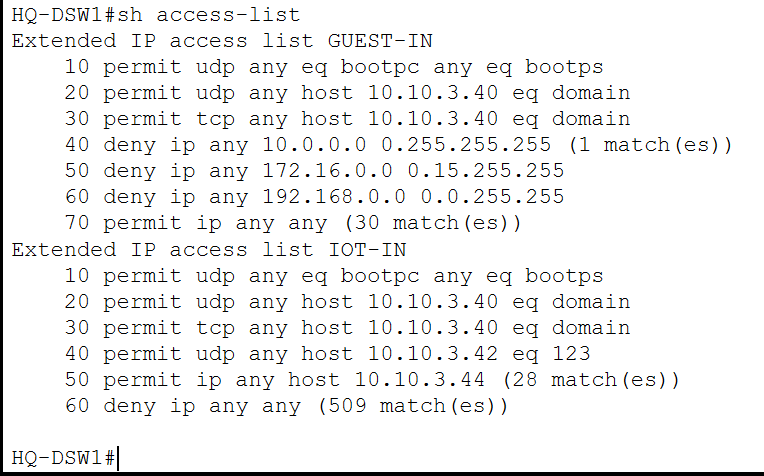

At Headquarters, the `GUEST-IN` policy prevents Guest clients from freely accessing internal private networks while still allowing permitted external connectivity.

The general policy is:

```text
Guest -> DHCP                  Allowed
Guest -> Internal DNS         Allowed
Guest -> Private Networks     Denied
Guest -> External Networks    Allowed
```

This allows visitors to use network connectivity without receiving the same access level as corporate users.

---

# IoT Network Isolation

IoT devices are also placed in dedicated VLANs.

Unlike normal enterprise users, IoT endpoints only require access to a limited set of infrastructure services.

The IoT ACL policy permits access to services including:

- DHCP
- Internal DNS
- NTP
- Central IoT registration server

and denies arbitrary access to other networks.

At Headquarters, the IoT registration server is:

`10.10.3.44`

The policy therefore follows the principle:

```text
IoT -> Required infrastructure     Allowed
IoT -> IoT registration server     Allowed
IoT -> Arbitrary internal access   Denied
```

This reduces the amount of trusted network access available to IoT endpoints.

---

# Branch Security Policies

Equivalent Guest and IoT policies were implemented at the branch sites.

## Melaka

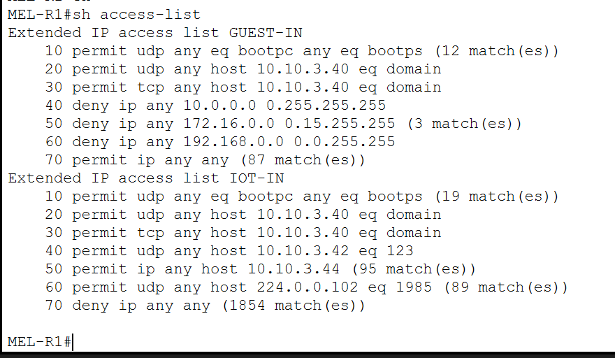

The Melaka ACLs restrict Guest and IoT networks while allowing the centralized services required by branch clients.

The IoT policy also includes HSRP control traffic required by the redundant branch gateway design.

## Kuching

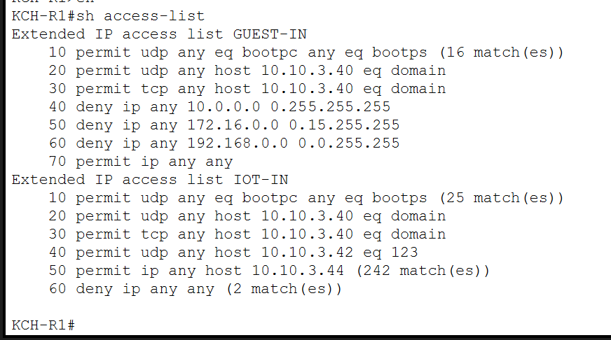

Kuching uses the same overall security principle:

- Guest users cannot freely access internal private networks.
- IoT devices can reach only required infrastructure and registration services.

This keeps security behavior consistent even though the branch routing architectures are different.

---

# DMZ Management Protection

The DMZ uses a dedicated management network:

`10.10.3.112/29`

Administrative access to this network is restricted.

The management policy permits traffic from selected trusted networks, including:

- HQ IT
- Network Management

while denying arbitrary access from other locations.

This prevents the DMZ management plane from being treated like a normal public service network.

The DMZ architecture is documented in detail in:

[DMZ and Internet Edge](08-dmz-internet-edge.md)

---

# DMZ-to-Internal Isolation

Public-facing servers are more exposed than normal internal systems.

For this reason, the project prevents DMZ servers from initiating arbitrary connections toward internal private networks.

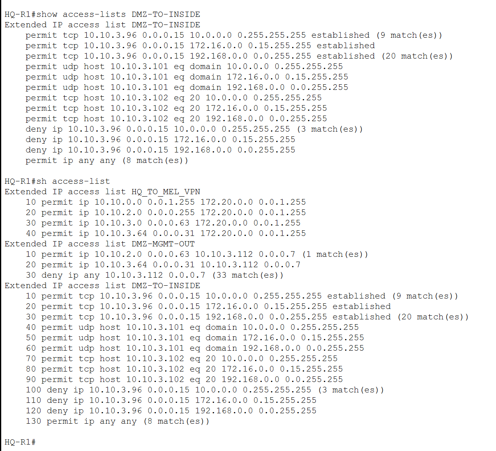

The policy allows required return traffic while blocking new unrestricted communication toward private enterprise address ranges.

The resulting behavior is:

| Traffic | Result |
|---|---|
| Internal user → DMZ service | Allowed |
| DMZ TCP return traffic | Allowed |
| Required DNS responses | Allowed |
| DMZ → arbitrary internal destination | Denied |
| DMZ → external network | Allowed |

This limits the potential for lateral movement if a public-facing server is compromised.

## Validation


Traffic initiated by the DMZ Web server toward devices at HQ, Melaka, and Kuching is blocked.

At the same time, internal users remain able to consume DMZ services:


The implementation therefore restricts DMZ-originated traffic without preventing legitimate internal access to public services.

---

# Internet Edge ACL

Inbound traffic from the ISP is filtered before being allowed toward enterprise resources.

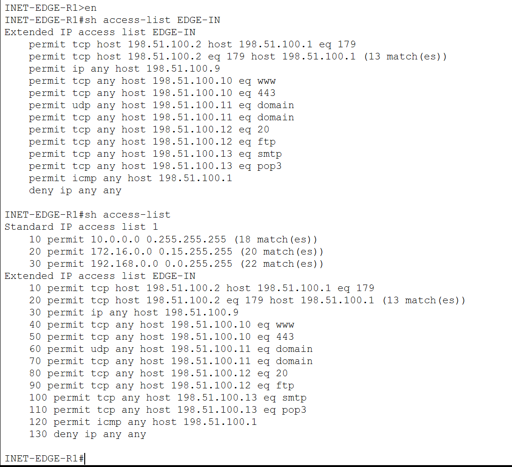

The Internet edge policy permits only the traffic required for:

- eBGP peering
- PAT operation
- Public Web
- HTTPS
- Public DNS
- FTP
- Mail
- Selected router ICMP traffic

The ACL ends with an explicit deny rule:

```text
deny ip any any
```

This ensures that unsolicited inbound traffic not matching an approved service is rejected.

The edge ACL complements NAT and IPS rather than replacing them.

---

# Access-Layer Port Security

Security is also applied at the switching access layer.

Selected user-facing ports use Port Security with:

- Sticky MAC learning
- Maximum MAC limits
- Restrict violation mode

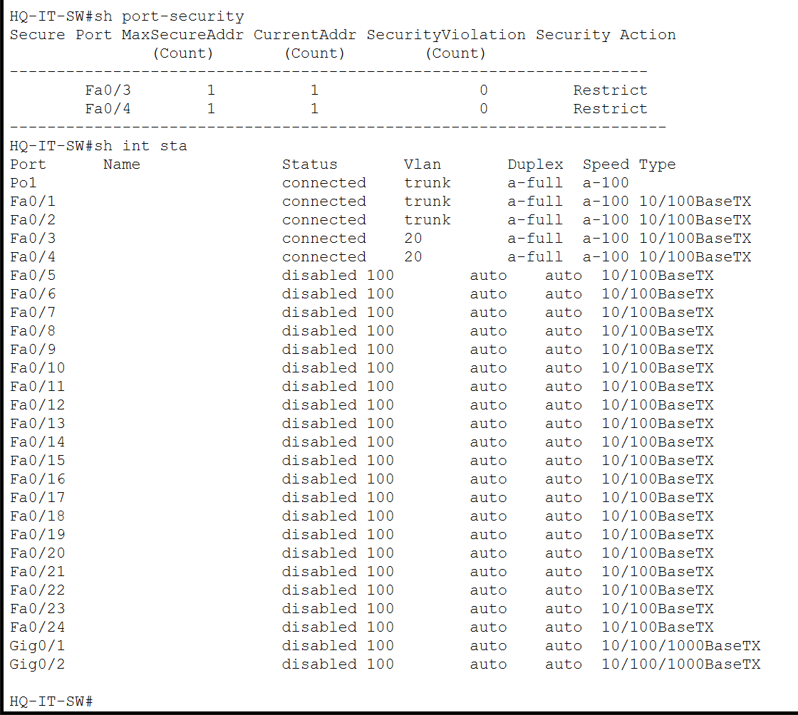

A normal workstation access port is limited to one learned MAC address.

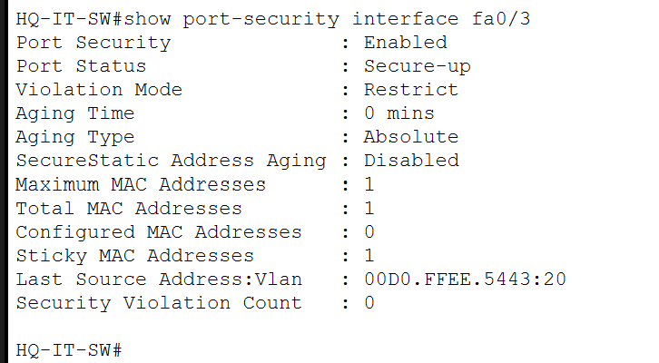

Ports supporting an IP phone and attached workstation were configured with a maximum of two MAC addresses because both devices legitimately appear on the same switch interface.

This was required at Kuching for the voice deployment.

---

# Unused Port Protection

Unused access ports are:

- Assigned to VLAN 100
- Administratively shut down

VLAN 100 functions as a blackhole VLAN and is not used for normal endpoint connectivity.

This prevents an unused physical port from immediately providing access to a production user VLAN.

The implementation is visible in the Layer 2 Port Security screenshots and is documented further in:

[Layer 2 Design](03-layer2-design.md)

---

# Site-to-Site IPsec VPN

A site-to-site IPsec VPN protects selected communication between Headquarters and Melaka.

The VPN peers are:

| Site | Peer Address |
|---|---|
| Headquarters | `10.255.0.2` |
| Melaka | `10.255.0.6` |

The VPN uses an ISAKMP / IPsec configuration with AES and SHA-based protection.

## ISAKMP Security Association


The state:

`QM_IDLE`

with status:

`ACTIVE`

confirms that the IKE security association has been successfully established.

---

# IPsec Encrypted Traffic


The IPsec security association shows non-zero packet counters for:

- Encapsulation
- Encryption
- Decapsulation
- Decryption

These counters demonstrate that traffic has actually crossed the VPN tunnel.

This is stronger evidence than only showing the crypto configuration because it confirms active protected communication between the two sites.

---

# IOS Intrusion Prevention System

An IOS IPS router is positioned between the enterprise Internet edge and the corporate WAN.

The rule is named:

`CORP-IPS`

and is applied inbound on the interface receiving traffic from the Internet edge.

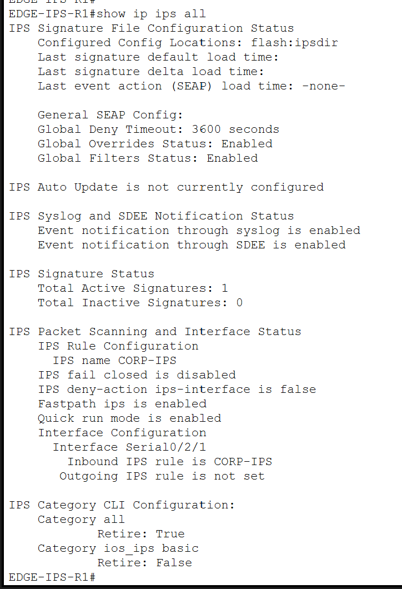

The status output confirms:

- IPS rule `CORP-IPS`
- Active signature processing
- Inbound inspection
- `ios_ips basic` signature category enabled

---

# IPS Validation Method

The normal Internet edge ACL already blocked ICMP traffic toward the public Web address.

This meant that ICMP packets were discarded before reaching the IPS.

To test the IPS independently, a temporary and highly specific ACL exception was created for the external security test host:

`203.0.114.20`

toward the public Web address:

`198.51.100.10`

The test exception allowed only ICMP Echo traffic from that specific source to that specific destination.

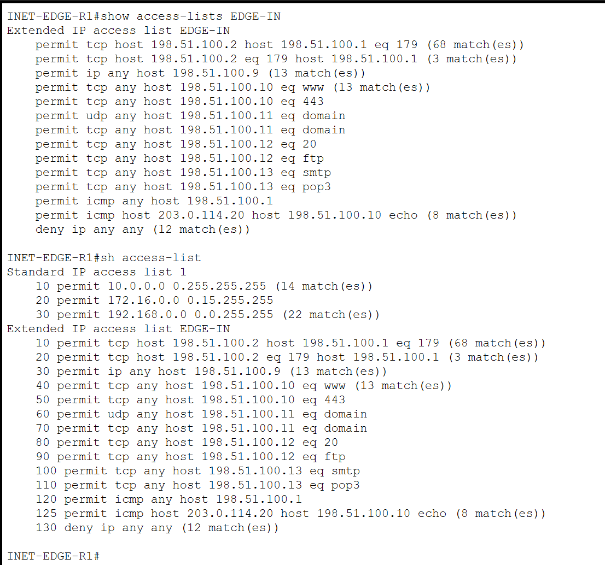

The rule generated match counters, confirming that the test packets were allowed through the edge ACL and reached the IPS inspection path.

The temporary exception was removed after testing.

The final Internet edge configuration therefore returned to the more restrictive production-style ACL shown earlier.

---

# IPS Blocking Test

Before the IPS signature was enabled for the test, the external security host could successfully ping the public Web address.

After the signature was enabled with an inline deny action, the same traffic was blocked.


The test demonstrates a clear behavioral change:

```text
Before IPS enforcement:

ICMP Echo
External host --------------------> Public Web
                    Allowed


After IPS enforcement:

ICMP Echo
External host --------> IOS IPS ----X----> Public Web
                         Detected
                         Dropped
```

The edge ACL was deliberately allowing the test traffic at this point, so the observed drop was not caused by the normal perimeter deny rule.

---

# Legitimate Traffic During IPS Enforcement

Blocking the ICMP test did not prevent legitimate HTTP access to the same public server.


The external test host remained able to access:

`http://198.51.100.10`

while ICMP Echo traffic was blocked.

This demonstrates selective security behavior rather than complete service disruption.

---

# AAA / RADIUS

Centralized authentication is provided by the HQ AAA server:

`10.10.3.41`

The secure management implementation was demonstrated on:

`HQ-IT-SW`

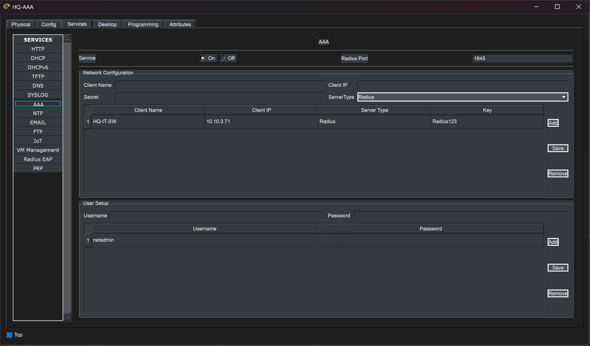

The switch is registered as a RADIUS client and authenticates remote management users against the centralized AAA service.

A local account also exists as a fallback authentication method.

The AAA method follows the logic:

```text
Remote Login
     |
     v
RADIUS Server
     |
     +---- Available ----> Central Authentication
     |
     +---- Unavailable --> Local Fallback
```

This implementation is intentionally demonstrated on one representative switch rather than being duplicated across every Packet Tracer device.

---

# SSHv2 Secure Management

Remote access to `HQ-IT-SW` was migrated from Telnet to SSH.

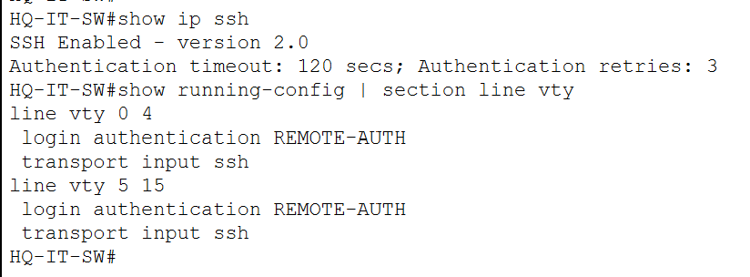

The verification confirms:

- SSH enabled
- SSH version 2.0
- VTY authentication using `REMOTE-AUTH`
- Only SSH accepted on the VTY lines

The VTY configuration therefore uses centralized AAA while preventing Telnet-based remote access.

---

# SSH and AAA Validation


A client at Headquarters successfully connects to:

`10.10.3.71`

using SSH and the centralized AAA user.

The same session also demonstrates access to privileged EXEC mode using the configured enable secret.

The test validates:

- Network reachability
- SSHv2
- VTY configuration
- RADIUS authentication
- Successful remote login
- Privileged mode protection
- Proper session termination

---

# Local Device Access Security

The representative secure-management switch also includes:

- Console password protection
- Enable secret
- MOTD security banner

A simple warning banner is displayed:

`Authorized access only.`

This demonstrates basic local device hardening in addition to secure remote management.

The main portfolio evidence focuses on SSH and AAA because those controls provide the stronger remote-management demonstration.

---

# Security Control Summary

| Security Control | Purpose |
|---|---|
| VLAN Segmentation | Separate departments and service types |
| Guest ACL | Prevent visitor access to private enterprise networks |
| IoT ACL | Restrict IoT devices to required services |
| Port Security | Limit MAC addresses on access interfaces |
| Blackhole VLAN | Isolate unused switch ports |
| DMZ Management ACL | Protect administrative DMZ access |
| DMZ-to-Inside ACL | Prevent arbitrary DMZ-initiated internal access |
| Internet Edge ACL | Restrict unsolicited external traffic |
| NAT / PAT | Separate private and public addressing |
| IPsec VPN | Protect HQ-to-Melaka traffic |
| IOS IPS | Inspect and block selected malicious traffic |
| AAA / RADIUS | Centralize remote authentication |
| SSHv2 | Protect remote management sessions |

The controls operate at different layers and locations in the topology, creating a defense-in-depth architecture.

---

# IPv6 Security Scope

The project implements its ACL security policies primarily for IPv4.

IPv6 routing and end-to-end connectivity are fully implemented, but equivalent IPv6 ACL policies were not deployed across every protected segment.

In a production dual-stack environment, IPv4 and IPv6 security policies should provide equivalent protection.

This is treated as a project scope limitation rather than claiming complete dual-stack filtering.

Additional Packet Tracer and implementation limitations are documented in:

[Testing and Packet Tracer Limitations](10-testing-limitations.md)

---

# Validation

The security implementation was validated through:

- ACL inspection and match counters
- Guest and IoT traffic restrictions
- DMZ isolation tests
- Port Security status
- Internet edge filtering
- ISAKMP tunnel status
- IPsec encrypted packet counters
- IPS operational status
- Controlled IPS blocking test
- HTTP availability during IPS enforcement
- AAA server configuration
- SSHv2 verification
- Successful SSH / RADIUS login

The emphasis was placed on demonstrating observable behavior rather than only showing configuration commands.

---

## Related Documentation

- [Network Architecture](01-architecture.md)
- [Layer 2 Design](03-layer2-design.md)
- [Routing and Redundancy](04-routing-redundancy.md)
- [Network Services](06-network-services.md)
- [Wireless, IoT and VoIP](07-wireless-iot-voip.md)
- [DMZ and Internet Edge](08-dmz-internet-edge.md)
- [Testing and Packet Tracer Limitations](10-testing-limitations.md)
