# Testing and Packet Tracer Limitations

## Overview

The project was validated progressively during implementation rather than only at the end.

Testing was performed across the main functional areas of the network, including:

- Layer 2 switching
- Inter-VLAN routing
- HSRP
- OSPFv2
- OSPFv3
- IPv4 and IPv6 connectivity
- DHCP and DHCP relay
- DNS
- NTP and Syslog
- Wireless connectivity
- IoT registration and automation
- VoIP
- DMZ services
- NAT / PAT
- eBGP
- IPsec VPN
- ACL enforcement
- IOS IPS
- AAA / RADIUS
- SSHv2

The goal was to verify observable network behavior rather than relying only on configuration output.

---

# Validation Strategy

The validation process followed three general principles:

### Configuration Verification

Cisco IOS `show` commands were used to confirm that protocols and features were active.

Examples include:

- `show vlan brief`
- `show interfaces trunk`
- `show etherchannel summary`
- `show spanning-tree`
- `show standby brief`
- `show ip ospf neighbor`
- `show ipv6 ospf neighbor`
- `show ip route ospf`
- `show ipv6 route ospf`
- `show ip nat translations`
- `show ip bgp summary`
- `show crypto isakmp sa`
- `show crypto ipsec sa`
- `show ip ips all`
- `show ip ssh`

### Functional Testing

Endpoints were used to verify actual service delivery.

Examples include:

- DHCP address assignment
- DNS resolution
- Intranet access
- Internet access
- Wireless client connectivity
- IPv6 inter-site ping
- VoIP calls
- Public Web access
- FTP authentication
- SSH login

### Security Testing

Traffic was intentionally permitted or denied to validate security controls.

Examples include:

- Guest network restrictions
- IoT restrictions
- DMZ-to-internal isolation
- Internet edge filtering
- IPS blocking
- VPN packet encryption
- AAA authentication

---

# Routing Validation

OSPF neighbor relationships were verified across the corporate WAN.

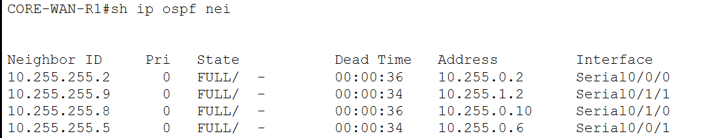

The routing table was also inspected to confirm that remote site prefixes were dynamically learned.

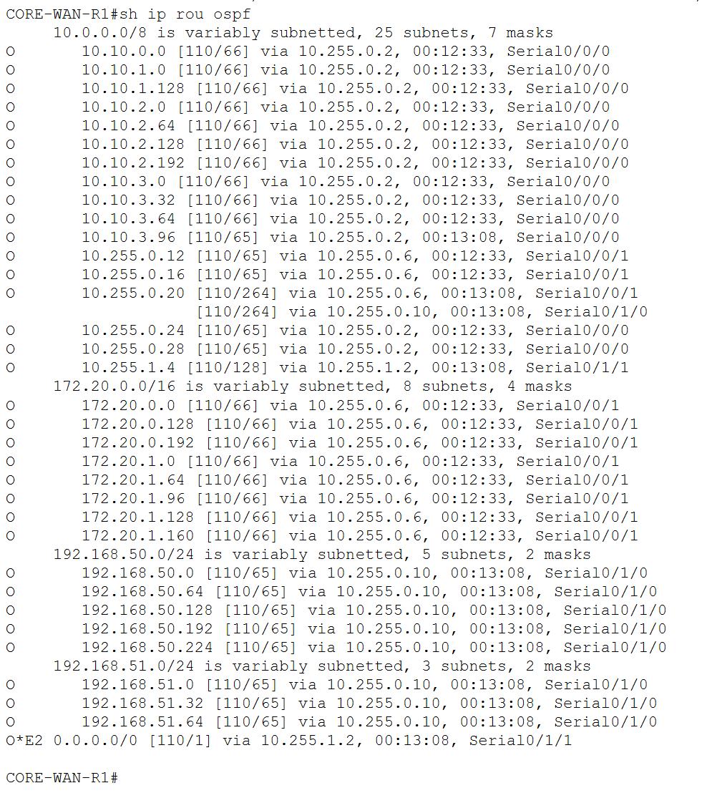

The higher-cost Melaka–Kuching link was validated separately to confirm that it remained available as an alternate route without becoming the preferred normal path.

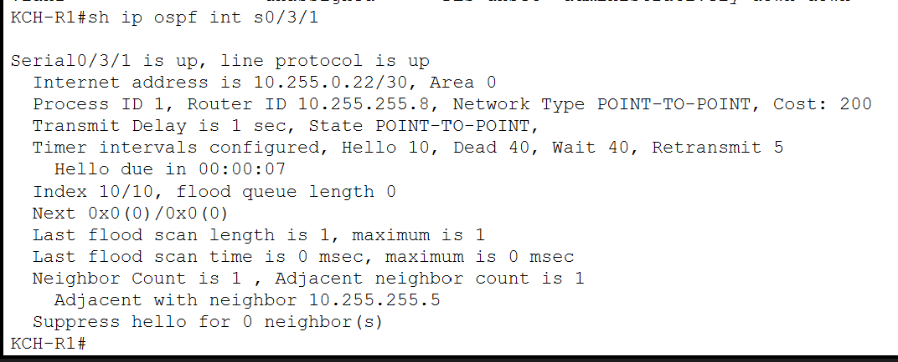

---

# IPv6 Validation

IPv6 was tested as an end-to-end routed service rather than only by checking interface addresses.

OSPFv3 neighbor relationships and IPv6 routes were verified first.

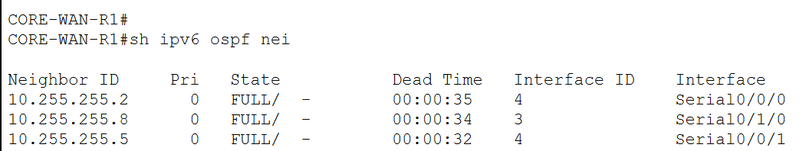

Inter-site IPv6 communication was then tested successfully.

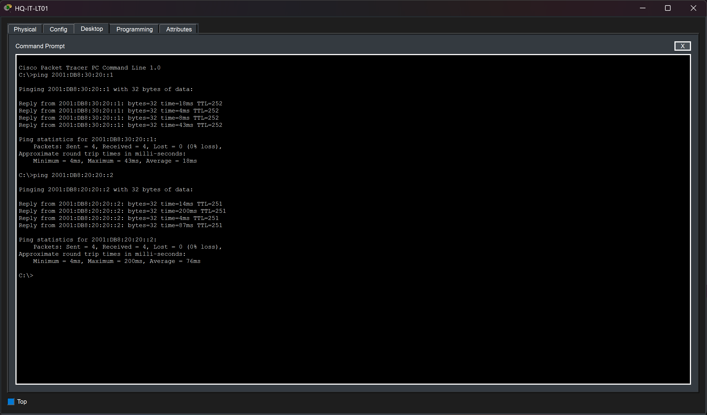

This confirmed the combined operation of:

- IPv6 addressing
- SLAAC
- IPv6 gateways
- OSPFv3
- WAN routing

---

# Centralized Service Validation

A remote Kuching client successfully obtained its IPv4 configuration from the centralized DHCP server at Headquarters.

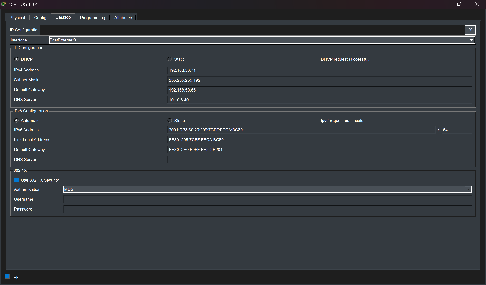

Internal DNS resolution was also validated.

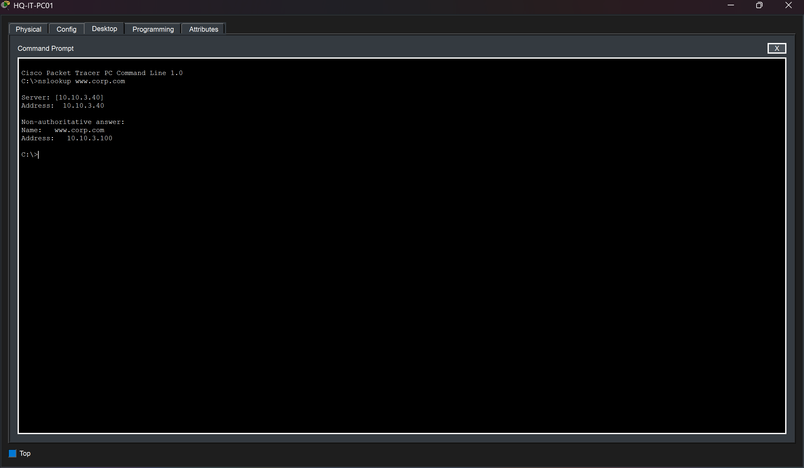

The same service infrastructure was tested through:

- Intranet access
- NTP synchronization
- Centralized Syslog
- DHCP relay

These tests confirmed that branch clients could consume shared services across the routed WAN.

---

# Wireless Validation

Wireless clients were tested on separate enterprise WLANs.

Staff wireless connectivity confirmed:

- WLAN association
- DHCP
- Central DNS
- IPv6 SLAAC


Guest clients were tested separately to verify that their addressing and security policy were distinct from Staff access.

---

# IoT Validation

IoT devices from multiple enterprise sites successfully registered with the centralized IoT server.


Automation rules were also tested to confirm that sensors could trigger actions on other IoT devices.


This demonstrated that IoT connectivity was functional across the routed enterprise network rather than only within a single local segment.

---

# VoIP Validation

The Kuching VoIP deployment was validated through an actual simulated phone call.


The successful call confirmed the operation of:

- Voice VLAN
- Local DHCP
- Option 150
- Cisco CME
- Phone registration
- Extension configuration

---

# Internet and DMZ Validation

Public and outbound connectivity were tested independently.

Internal users successfully reached the simulated Internet server through PAT.

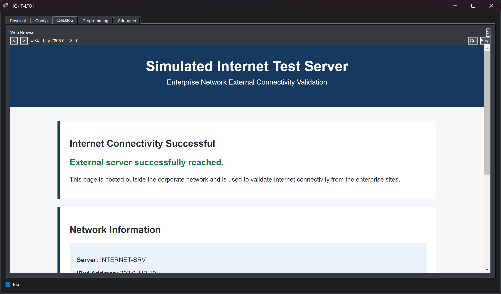

External clients successfully reached the published corporate Web service through:

- ISP routing
- eBGP
- Public DNS
- Internet edge filtering
- Static NAT
- DMZ routing


The NAT translation table was used to verify active translations from multiple internal sites.

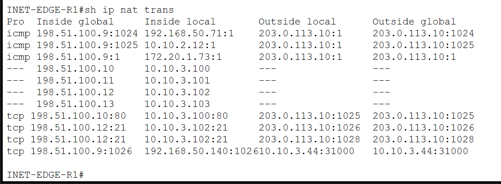

---

# VPN Validation

The HQ-to-Melaka site-to-site VPN was validated at both IKE and IPsec levels.

The ISAKMP security association reached an active state.

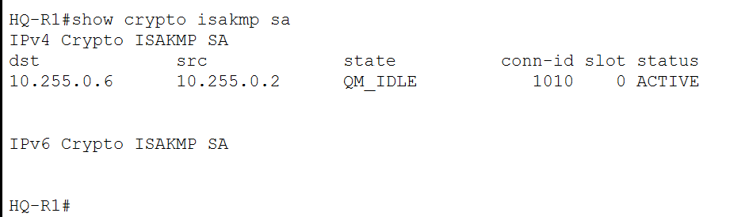

Encrypted packet counters were then inspected.

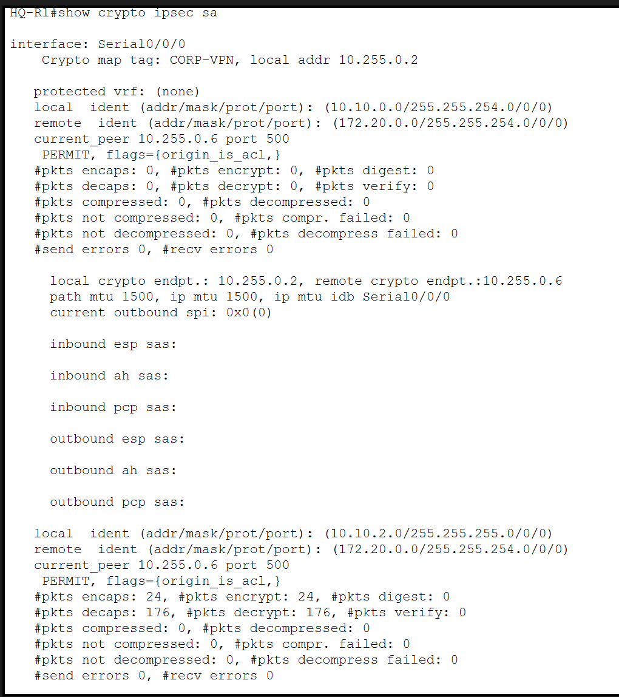

Non-zero encryption and decryption counters confirmed that traffic was actually traversing the tunnel.

---

# IPS Validation

The IPS was tested using a dedicated external security test host.

A temporary, highly specific Internet edge ACL exception allowed controlled ICMP traffic to reach the IPS.

Before IPS enforcement, the traffic was successful.

After the signature was enabled with an inline deny action, the same traffic was blocked.

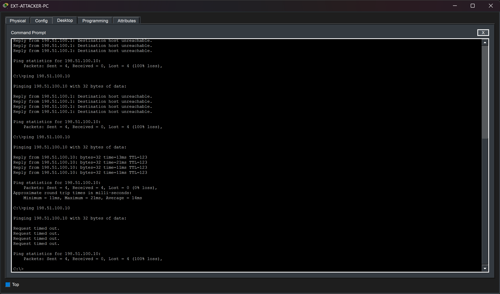

Legitimate HTTP access remained available during the test.

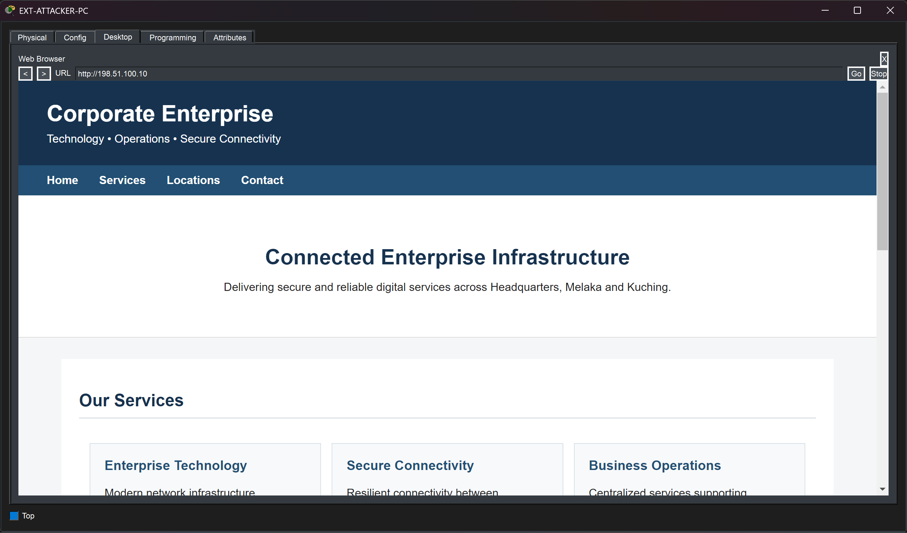

After validation, the temporary test ACL entry was removed and the normal Internet edge policy was restored.

---

# Secure Management Validation

SSHv2 and centralized AAA authentication were validated on the representative management device `HQ-IT-SW`.

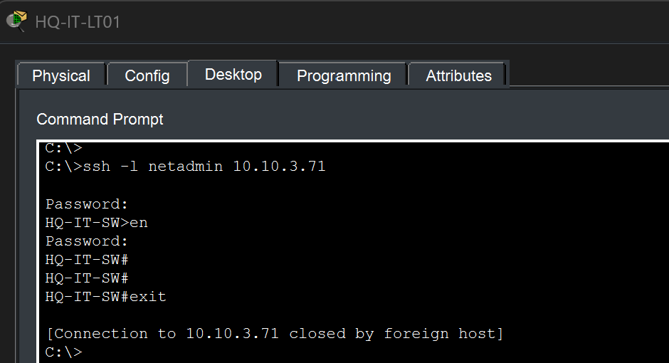

The successful session confirmed:

- SSHv2 connectivity
- RADIUS authentication
- VTY AAA configuration
- Privileged EXEC protection
- Session termination

---

# DMZ Isolation Validation

DMZ servers were tested against internal endpoints located at all three enterprise sites.

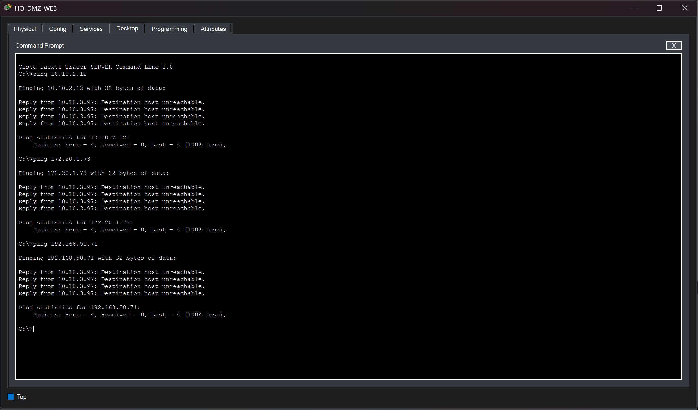

The attempts were blocked as expected.

At the same time, internal clients remained able to access DMZ-hosted services.

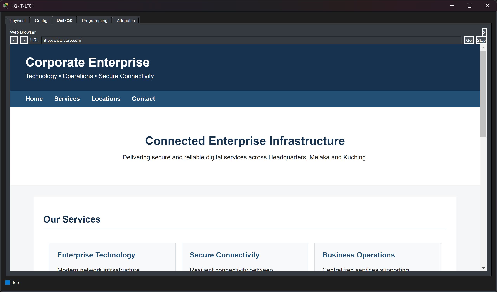

This confirmed the intended asymmetric policy:

```text
Internal client -> DMZ service       Allowed
DMZ server -> new internal session   Denied
```

---

# Packet Tracer Limitations

Cisco Packet Tracer was sufficient to build and validate the overall architecture, but several simulator-specific limitations were encountered.

These limitations influenced some implementation decisions.

---

## Wireless LAN Controller Behavior

Centralized WLC switching and authentication behavior was not consistently reliable in the Packet Tracer environment.

The final wireless implementation therefore uses:

- Local switching
- Local authentication

This preserved stable WLAN operation while maintaining the intended Staff, Guest, and IoT VLAN separation.

This should not be interpreted as the only possible design on real Cisco wireless infrastructure.

---

## Cisco CME Platform Support

The Packet Tracer 2911 router did not provide the required `telephony-service` functionality during the VoIP implementation.

The Kuching router was therefore changed to a Cisco 2811.

The 2811 successfully supported:

- Cisco CME
- IP phone registration
- Extension configuration
- Voice DHCP
- Option 150

This was a simulator platform constraint rather than an architectural requirement.

---

## HQ IPv6 Multilayer Switching

The HQ multilayer switches initially did not provide the required IPv6 Layer 3 functionality.

An IPv4/IPv6-capable SDM template had to be selected and the switches reloaded before the required IPv6 routing and HSRPv6 features became available.

This reflects Packet Tracer's simulated switch platform behavior.

---

## HSRPv6 at Melaka

IPv6 HSRP was configured and operational at the Melaka branch.

However, Packet Tracer showed inconsistent forwarding behavior during some failover scenarios even though the HSRP states appeared correct.

Normal forwarding with the preferred router active operated as expected.

Because of this simulator behavior, IPv6 HSRP failover was not treated as a production-equivalent resiliency test.

---

## HQ ACL Interface Binding Persistence

A Packet Tracer persistence issue was observed on the HQ multilayer switches.

After closing and reopening the `.pkt` file:

- ACL definitions could remain present
- Some `ip access-group` bindings on SVIs could disappear

The ACLs therefore sometimes needed to be re-applied to the affected HQ VLAN interfaces after reopening the project.

The intended bindings include:

```text
VLAN 120 -> GUEST-IN
VLAN 130 -> IOT-IN
```

on the relevant HQ distribution SVIs.

This is documented as a simulator persistence issue rather than an intended network behavior.

---

## DHCP Snooping

DHCP Snooping was tested during development.

In Packet Tracer, enabling the feature caused DHCP behavior to become unreliable in the existing topology.

Because it negatively affected legitimate DHCP functionality, DHCP Snooping was removed from the final design.

The final project therefore does **not** claim DHCP Snooping as an implemented security control.

---

## FTP Through Static NAT

Public FTP authentication successfully reaches the DMZ FTP server through static NAT.

However, Packet Tracer did not reliably complete the passive FTP data connection required for external directory listing.

The following behavior was observed:

```text
External FTP authentication   Successful
External directory listing    Timeout
Internal directory listing    Successful
```

Internal testing confirmed that:

- The FTP service itself was operational
- User permissions were valid
- Directory listing worked locally

The remaining external data-channel issue is therefore treated as a Packet Tracer FTP/NAT limitation.

---

## AAA Fallback Testing

The AAA configuration uses centralized RADIUS authentication with a local fallback method.

During testing, Packet Tracer did not reliably transition to the local fallback account when the RADIUS server was manually disabled.

The remote login could remain waiting for the unavailable AAA server instead.

Because of this simulator behavior, the final validation demonstrates successful centralized RADIUS authentication but does not claim a verified AAA server-failure fallback test.

---

## IOS IPS Simulation

Packet Tracer provides a simplified IOS IPS implementation.

During configuration and verification, some IPS status commands reported signature state information differently.

For this reason, IPS validation relied primarily on observable traffic behavior:

- ICMP permitted through the temporary edge test ACL
- ICMP successfully passing before enforcement
- ICMP blocked after IPS enforcement
- HTTP remaining available

This provided a clearer functional demonstration than relying only on simulator status counters.

---

## Syslog Command Support

Some IOS logging command options normally available on Cisco IOS were not accepted by the Packet Tracer device implementation.

The project therefore uses the logging functionality supported by the simulator while still demonstrating centralized Syslog event collection.

---

# Security Scope Limitation

The enterprise uses dual-stack IPv4 and IPv6 routing, but most ACL-based security controls were implemented for IPv4.

Equivalent IPv6 ACL policy was not deployed across every protected segment.

A production dual-stack environment should apply equivalent security policy to both protocol families.

The project therefore demonstrates:

```text
IPv4 + IPv6 routing        Implemented
IPv4 security ACLs         Implemented
Full IPv6 ACL parity       Outside final project scope
```

---

# Simulation Scope

This project is an enterprise networking lab built in Cisco Packet Tracer.

It demonstrates networking concepts and their interaction in a controlled environment.

It is not intended to represent every feature that would normally exist in a production network.

A production deployment would typically include additional technologies such as:

- Stateful enterprise firewalls
- High-availability Internet edge devices
- Production wireless authentication such as 802.1X
- Enterprise monitoring platforms
- Configuration management
- Full IPv4 / IPv6 security policy parity
- More advanced routing policy
- Certificate-based administration
- Dedicated IDS / IPS platforms
- Centralized identity infrastructure

The project intentionally focuses on technologies that can be meaningfully implemented and validated inside Packet Tracer.

---

# Final Validation Summary

The final topology was tested across the main networking, services, redundancy, and security components.

The following areas were validated during the project:

- VLAN segmentation and 802.1Q trunking
- LACP EtherChannel and Rapid-PVST
- Port Security and unused-port isolation
- HSRP for IPv4 and IPv6
- OSPFv2 and OSPFv3
- IPv4 and IPv6 inter-site routing
- DHCP and DHCP relay
- Internal DNS, NTP, Syslog, and intranet access
- Wireless Staff, Guest, and IoT connectivity
- IoT registration and automation
- VoIP and Cisco CME
- DMZ services and segmentation
- NAT, PAT, and static NAT
- eBGP Internet edge routing
- Public DNS and Web access
- Site-to-site IPsec VPN
- Guest and IoT ACL policies
- DMZ-to-internal isolation
- Internet edge ACL filtering
- IOS IPS testing
- AAA / RADIUS authentication
- SSHv2 remote management

The screenshots throughout the documentation provide the corresponding validation evidence.

---

## Related Documentation

- [Network Architecture](01-architecture.md)
- [IP Addressing and VLAN Design](02-ip-addressing-vlans.md)
- [Layer 2 Design](03-layer2-design.md)
- [Routing and Redundancy](04-routing-redundancy.md)
- [IPv6 Design](05-ipv6.md)
- [Network Services](06-network-services.md)
- [Wireless, IoT and VoIP](07-wireless-iot-voip.md)
- [DMZ and Internet Edge](08-dmz-internet-edge.md)
- [Security](09-security.md)
